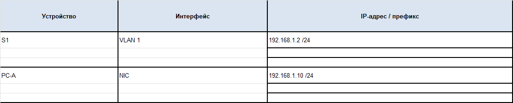
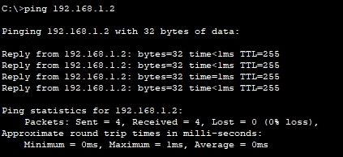
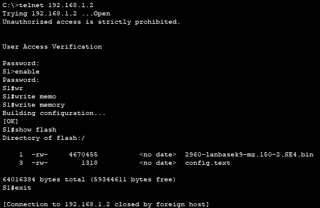

# Лабораторная работа. Базовая настройка коммутатора 

- [Лабораторная работа. Базовая настройка коммутатора](#лабораторная-работа-базовая-настройка-коммутатора)
  - [Топология](#топология)
  - [Таблица адресации](#таблица-адресации)
  - [Часть 1. Создание сети и проверка настроек коммутатора по умолчанию](#часть-1-создание-сети-и-проверка-настроек-коммутатора-по-умолчанию)
  - [Часть 2. Настройка базовых параметров сетевых устройств](#часть-2-настройка-базовых-параметров-сетевых-устройств)
  - [Часть 3. Проверка сетевых подключений](#часть-3-проверка-сетевых-подключений)
    - [Шаг 1. Отобразите конфигурацию коммутатора.](#шаг-1-отобразите-конфигурацию-коммутатора)
    - [Шаг 2. Протестируйте сквозное соединение, отправив эхо-запрос.](#шаг-2-протестируйте-сквозное-соединение-отправив-эхо-запрос)
    - [Шаг 3. Проверьте удаленное управление коммутатором S1.](#шаг-3-проверьте-удаленное-управление-коммутатором-s1)

## Топология


## Таблица адресации



##  Часть 1. Создание сети и проверка настроек коммутатора по умолчанию

**b.	Изучите текущий файл running configuration.\
Вопросы:\
Сколько интерфейсов FastEthernet имеется на коммутаторе 2960?**

*24*

**Сколько интерфейсов Gigabit Ethernet имеется на коммутаторе 2960?**

*2*

**Каков диапазон значений, отображаемых в vty-линиях?**

*line vty 0 4*\
*line vty 5 15*

**c.	Изучите файл загрузочной конфигурации (startup configuration), который содержится в энергонезависимом ОЗУ (NVRAM).\
Вопрос:\
Почему появляется это сообщение?**

*startup-config is not present*\
*Новое устройство, NVRAM ничего не хранится*


**d.	Изучите характеристики SVI для VLAN 1.
Вопросы:
Назначен ли IP-адрес сети VLAN 1?**

*interface Vlan1\
 no ip address\
 shutdown*


**e.	Изучите IP-свойства интерфейса SVI сети VLAN 1.
Вопрос:
Какие выходные данные вы видите?**

*Интерфейс отключен*

**f.	Подсоедините кабель Ethernet компьютера PC-A к порту 6 на коммутаторе и\
изучите IP-свойства интерфейса SVI сети VLAN 1. \
Дождитесь согласования параметров скорости и дуплекса между коммутатором и ПК.\
Вопрос: \
Какие выходные данные вы видите?**

```
VLAN Name                             Status    Ports
---- -------------------------------- --------- -------------------------------
1    default                          active    Fa0/1, Fa0/2, Fa0/3, Fa0/4
                                                Fa0/5, Fa0/6, Fa0/7, Fa0/8
                                                Fa0/9, Fa0/10, Fa0/11, Fa0/12
                                                Fa0/13, Fa0/14, Fa0/15, Fa0/16
                                                Fa0/17, Fa0/18, Fa0/19, Fa0/20
                                                Fa0/21, Fa0/22, Fa0/23, Fa0/24
                                                Gig0/1, Gig0/2
1002 fddi-default                     active    
1003 token-ring-default               active    
1004 fddinet-default                  active    
1005 trnet-default                    active    

VLAN Type  SAID       MTU   Parent RingNo BridgeNo Stp  BrdgMode Trans1 Trans2
---- ----- ---------- ----- ------ ------ -------- ---- -------- ------ ------
1    enet  100001     1500  -      -      -        -    -        0      0
1002 fddi  101002     1500  -      -      -        -    -        0      0   
1003 tr    101003     1500  -      -      -        -    -        0      0   
1004 fdnet 101004     1500  -      -      -        ieee -        0      0   
1005 trnet 101005     1500  -      -      -        ibm  -        0      0   

VLAN Type  SAID       MTU   Parent RingNo BridgeNo Stp  BrdgMode Trans1 Trans2
---- ----- ---------- ----- ------ ------ -------- ---- -------- ------ ------

Remote SPAN VLANs
------------------------------------------------------------------------------

Primary Secondary Type              Ports
------- --------- ----------------- ------------------------------------------
```

**g.	Изучите сведения о версии ОС Cisco IOS на коммутаторе.\
Вопросы:\
Под управлением какой версии ОС Cisco IOS работает коммутатор?**

*Cisco IOS Software, C2960 Software (C2960-LANBASEK9-M), Version 15.0(2)SE4, RELEASE SOFTWARE*

**Как называется файл образа системы?**

*"flash:c2960-lanbasek9-mz.150-2.SE4.bin*

**h.	Изучите свойства по умолчанию интерфейса FastEthernet, который \ используется компьютером PC-A. \
Switch# show interface f0/6 \
Вопрос: \
Интерфейс включен или выключен?**

*FastEthernet0/6 is up, line protocol is up (connected)*

**Что нужно сделать, чтобы включить интерфейс?***

*configure terminal\
interface fastethernet 0/6\
no shutdown*

**i.	Изучите флеш-память.\
Вопрос:\
Какое имя присвоено образу Cisco IOS?**

*2960-lanbasek9-mz.150-2.SE4.bin*


## Часть 2. Настройка базовых параметров сетевых устройств

**d.	Настройте каналы виртуального соединения для удаленного управления (vty), чтобы коммутатор разрешил доступ через Telnet. Если не настроить пароль VTY, будет невозможно подключиться к коммутатору по протоколу Telnet.\
Вопрос:\
Для чего нужна команда login?**

*Включить доступ к пользовательскому режиму EXEC или vty с помощью пароля*

## Часть 3. Проверка сетевых подключений

### Шаг 1. Отобразите конфигурацию коммутатора.

**a.	Пример конфигурации приведен ниже. Параметры, которые вы настроили, выделены желтым. Другие параметры конфигурации — значения IOS по умолчанию.**

```
S1# show run
Building configuration...

Current configuration : 1318 bytes
!
version 15.0
no service timestamps log datetime msec
no service timestamps debug datetime msec
service password-encryption
!
hostname S1
!
enable secret 5 $1$mERr$9cTjUIEqNGurQiFU.ZeCi1
!
!
!
no ip domain-lookup
!
!
!
spanning-tree mode pvst
spanning-tree extend system-id
!
interface FastEthernet0/1
!
interface FastEthernet0/2
!
interface FastEthernet0/3
!
interface FastEthernet0/4
!
interface FastEthernet0/5
!
interface FastEthernet0/6
!
interface FastEthernet0/7
!
interface FastEthernet0/8
!
interface FastEthernet0/9
!
interface FastEthernet0/10
!
interface FastEthernet0/11
!
interface FastEthernet0/12
!
interface FastEthernet0/13
!
interface FastEthernet0/14
!
interface FastEthernet0/15
!
interface FastEthernet0/16
!
interface FastEthernet0/17
!
interface FastEthernet0/18
!
interface FastEthernet0/19
!
interface FastEthernet0/20
!
interface FastEthernet0/21
!
interface FastEthernet0/22
!
interface FastEthernet0/23
!
interface FastEthernet0/24
!
interface GigabitEthernet0/1
!
interface GigabitEthernet0/2
!
interface Vlan1
 ip address 192.168.1.2 255.255.255.0
!
banner motd ^C
Unauthorized access is strictly prohibited. ^C
!
!
!
line con 0
 password 7 0822455D0A16
 logging synchronous
 login
!
line vty 0 4
 password 7 0822455D0A16
 login
line vty 5 15
 password 7 0822455D0A16
 login
!
!
!
!
end
```

**b.	Проверьте параметры VLAN 1.
S1# show interface vlan 1 
Какова полоса пропускания этого интерфейса?**

```
%Interface Vlan11 does not exist.

S1#show interfaces vlan 1
Vlan1 is up, line protocol is down
  Hardware is CPU Interface, address is 0001.c7c0.2b0b (bia 0001.c7c0.2b0b)
  Internet address is 192.168.1.2/24
  MTU 1500 bytes, BW 100000 Kbit, DLY 1000000 usec,
     reliability 255/255, txload 1/255, rxload 1/255
  Encapsulation ARPA, loopback not set
  ARP type: ARPA, ARP Timeout 04:00:00
  Last input 21:40:21, output never, output hang never
  Last clearing of "show interface" counters never
  Input queue: 0/75/0/0 (size/max/drops/flushes); Total output drops: 0
  Queueing strategy: fifo
  Output queue: 0/40 (size/max)
  5 minute input rate 0 bits/sec, 0 packets/sec
  5 minute output rate 0 bits/sec, 0 packets/sec
     1682 packets input, 530955 bytes, 0 no buffer
     Received 0 broadcasts (0 IP multicast)
     0 runts, 0 giants, 0 throttles
     0 input errors, 0 CRC, 0 frame, 0 overrun, 0 ignored
     563859 packets output, 0 bytes, 0 underruns
     0 output errors, 23 interface resets
     0 output buffer failures, 0 output buffers swapped out
```

### Шаг 2. Протестируйте сквозное соединение, отправив эхо-запрос.



### Шаг 3. Проверьте удаленное управление коммутатором S1.



[def]: #шаг-3-проверьте-удаленное-управление-коммутатором-s1