# Лабораторная работа. Просмотр таблицы MAC-адресов коммутатора

- [Лабораторная работа. Просмотр таблицы MAC-адресов коммутатора](#лабораторная-работа-просмотр-таблицы-mac-адресов-коммутатора)
  - [Топология](#топология)
  - [Таблица адресации](#таблица-адресации)
  - [Часть 1. Создание и настройка сети](#часть-1-создание-и-настройка-сети)
    - [Настройте базовые параметры каждого коммутатора](#настройте-базовые-параметры-каждого-коммутатора)
  - [Часть 2. Изучение таблицы МАС-адресов коммутатора](#часть-2-изучение-таблицы-мас-адресов-коммутатора)
    - [Запишите МАС-адреса сетевых устройств.](#запишите-мас-адреса-сетевых-устройств)
    - [Просмотрите таблицу МАС-адресов коммутатора.](#просмотрите-таблицу-мас-адресов-коммутатора)
    - [Очистите таблицу МАС-адресов коммутатора S2 и снова отобразите таблицу МАС-адресов.](#очистите-таблицу-мас-адресов-коммутатора-s2-и-снова-отобразите-таблицу-мас-адресов)
    - [С компьютера PC-B отправьте эхо-запросы устройствам в сети и просмотрите таблицу МАС-адресов коммутатора.](#с-компьютера-pc-b-отправьте-эхо-запросы-устройствам-в-сети-и-просмотрите-таблицу-мас-адресов-коммутатора)

## Топология

## Таблица адресации

## Часть 1. Создание и настройка сети

### Настройте базовые параметры каждого коммутатора

b.	Настройте IP-адреса, как указано в таблице адресации.

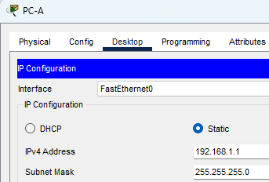

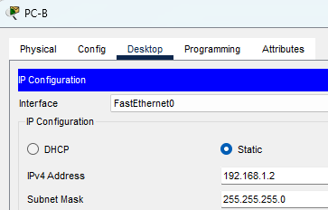

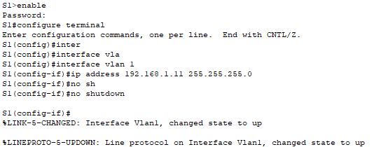

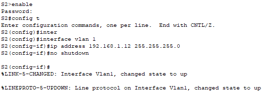

c.	Назначьте cisco в качестве паролей консоли и VTY.

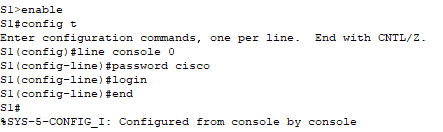

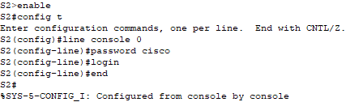

d.	Назначьте class в качестве пароля доступа к привилегированному режиму EXEC.

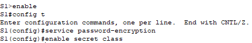

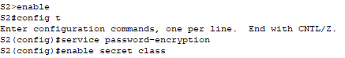

## Часть 2. Изучение таблицы МАС-адресов коммутатора

### Запишите МАС-адреса сетевых устройств.

MAC-адрес компьютера PC-A: 0001.C977.E1C9

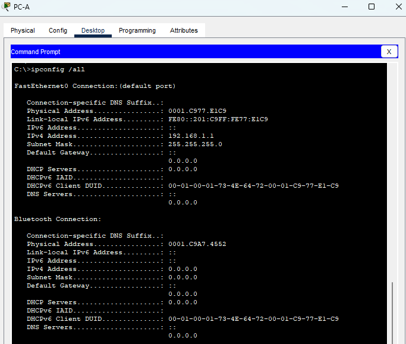

MAC-адрес компьютера PC-B: OOEO.BOE6.E052

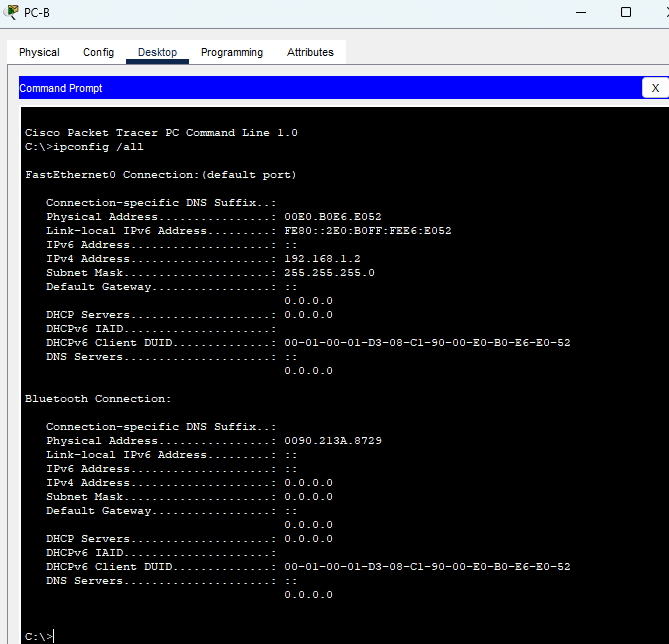

МАС-адрес коммутатора S1 Fast Ethernet 0/1: 00e0.b018.aa01

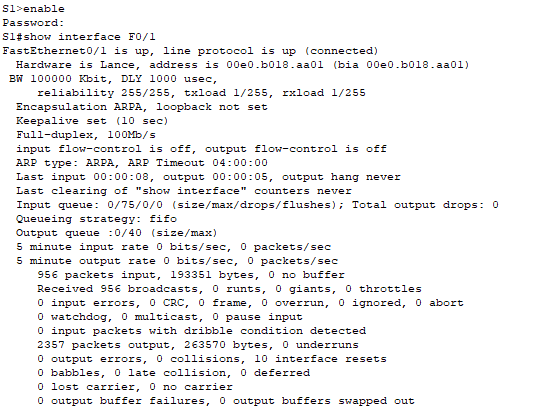

МАС-адрес коммутатора S2 Fast Ethernet 0/1: 0090.21b3.1501

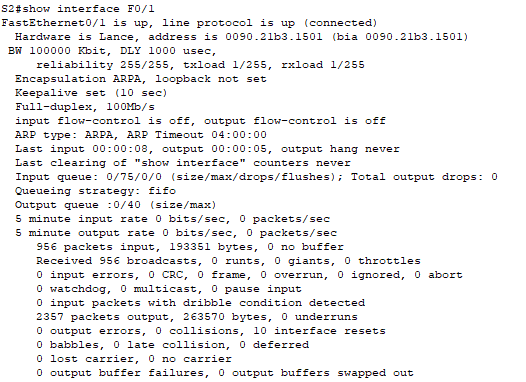

### Просмотрите таблицу МАС-адресов коммутатора.

Таблица MAC адресов коммутатора S2 до выполнения команды ping с компьютера PC-A содержит MAC адрес коммутатора S1 сопоставленный с портом Fa0/1

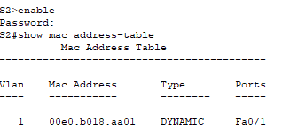

Таблица MAC адресов коммутатора S2 после выполнения команды ping с компьютера PC-A содержит:
* MAC адрес коммутатора S1 сопоставленный с портом Fa0/1
* MAC адрес компьютера PC-A сопоставленный с портом Fa0/1

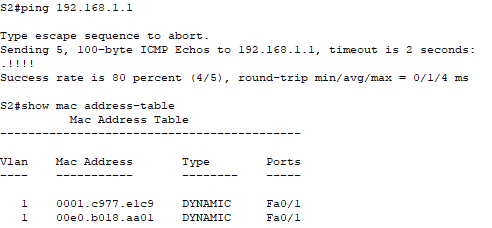

Команда show mac address-table покажет MAC адреса соседних активных устройств

### Очистите таблицу МАС-адресов коммутатора S2 и снова отобразите таблицу МАС-адресов.

Таблица MAC адресов коммутатора S2 сразу после выполнения команды clear mac address-table dynamic не содержат никаких записей

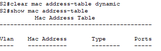

Через 10 секунд в таблице появилась запись о MAC адресе коммутатора S1

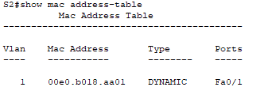

### С компьютера PC-B отправьте эхо-запросы устройствам в сети и просмотрите таблицу МАС-адресов коммутатора.

Изначально таблица записей ARP-кэша пуста

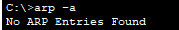

Выполянем ping всех устройств сети

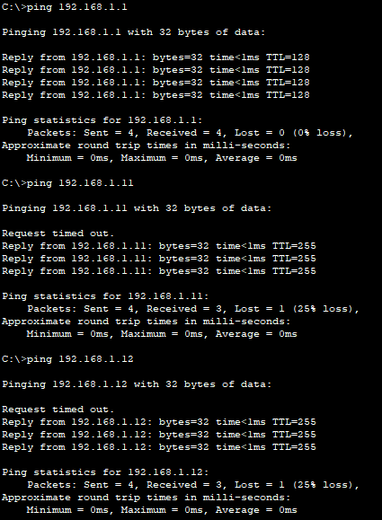

Коммутатор S2 обновил таблицу MAC адресов и портов
Теперь он содержит MAC адреса коммутатора S1 и MAC адрес компьютера PC-B

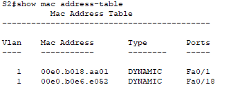

В ARP-кэше компьютера PC-B появилась запись MAC адреса коммутатора S2

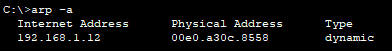