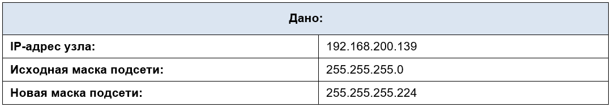
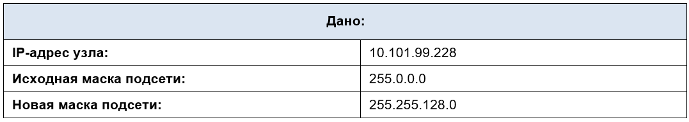
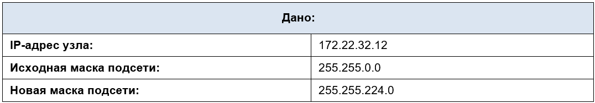
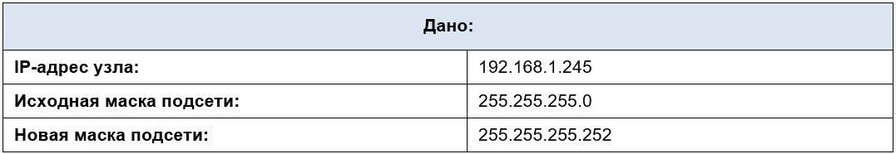
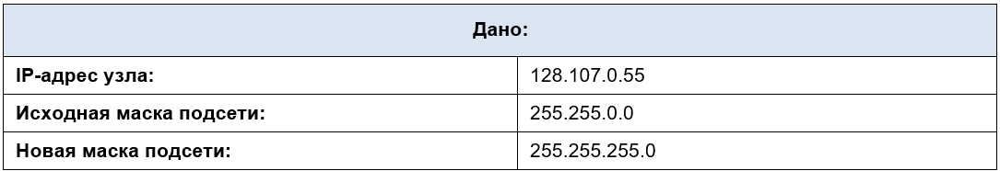
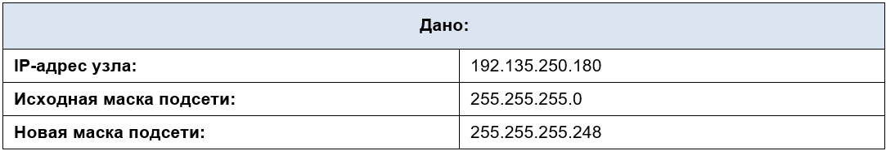

# Лабораторная работа - Расчет подсетей IPv4 

- [Лабораторная работа - Расчет подсетей IPv4](#лабораторная-работа---расчет-подсетей-ipv4)
  - [Общие сведения/сценарий](#общие-сведениясценарий)
  - [Необходимые ресурсы](#необходимые-ресурсы)
  - [Инструкции](#инструкции)
    - [Проблема1](#проблема1)
    - [Проблема2](#проблема2)
    - [Проблема3](#проблема3)
    - [Проблема4](#проблема4)
    - [Проблема5](#проблема5)
    - [Проблема6](#проблема6)

## 	Общие сведения/сценарий

Умение работать с IPv4-подсетями и определять информацию о сетях и узлах на основе известного IP-адреса и маски подсети необходимо для понимания принципов работы IPv4-сетей. Цель первой части — закрепить знания о том, как рассчитывать IP-адрес сети на основе известного IP-адреса и маски подсети. Зная IP-адрес и маску подсети, вы всегда сможете получить другие данные об этой подсети.

## 	Необходимые ресурсы

*	1 ПК (Windows с доступом в Интернет)
*	Дополнительно: калькулятор IPv4-адресов

## Инструкции

Заполните приведенные ниже таблицы, зная заданный IPv4-адрес, исходную и новую маску подсети.

### Проблема1

### Проблема2

### Проблема3

### Проблема4

### Проблема5

### Проблема6

