# Лабораторная работа. Настройка IPv6-адресов на сетевых устройствах 

- [Лабораторная работа. Настройка IPv6-адресов на сетевых устройствах](#лабораторная-работа-настройка-ipv6-адресов-на-сетевых-устройствах)
  - [Топология](#топология)
  - [Таблица адресации](#таблица-адресации)
  - [Часть 2. Ручная настройка IPv6-адресов](#часть-2-ручная-настройка-ipv6-адресов)
    - [Шаг 1. Назначьте IPv6-адреса интерфейсам Ethernet на R1.](#шаг-1-назначьте-ipv6-адреса-интерфейсам-ethernet-на-r1)
    - [Шаг 2. Активируйте IPv6-маршрутизацию на R1.](#шаг-2-активируйте-ipv6-маршрутизацию-на-r1)
    - [Шаг 3. Назначьте IPv6-адреса интерфейсу управления (SVI) на S1.](#шаг-3-назначьте-ipv6-адреса-интерфейсу-управления-svi-на-s1)
    - [Шаг 4. Назначьте компьютерам статические IPv6-адреса.](#шаг-4-назначьте-компьютерам-статические-ipv6-адреса)
  - [Часть 3. Проверка сквозного подключения](#часть-3-проверка-сквозного-подключения)
  - [Вопросы для повторения](#вопросы-для-повторения)

## Топология

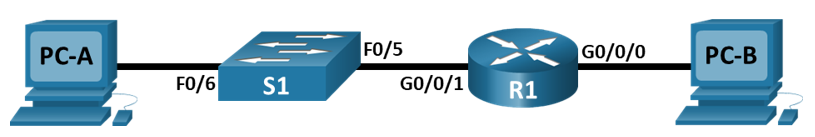

## Таблица адресации

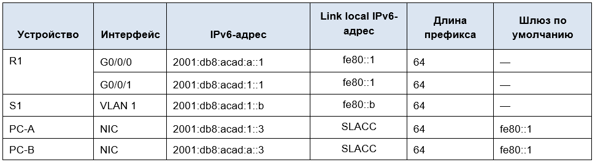

## Часть 2. Ручная настройка IPv6-адресов

### Шаг 1. Назначьте IPv6-адреса интерфейсам Ethernet на R1.
**a.	Назначьте глобальные индивидуальные IPv6-адреса, указанные в таблице адресации обоим интерфейсам Ethernet на R1.
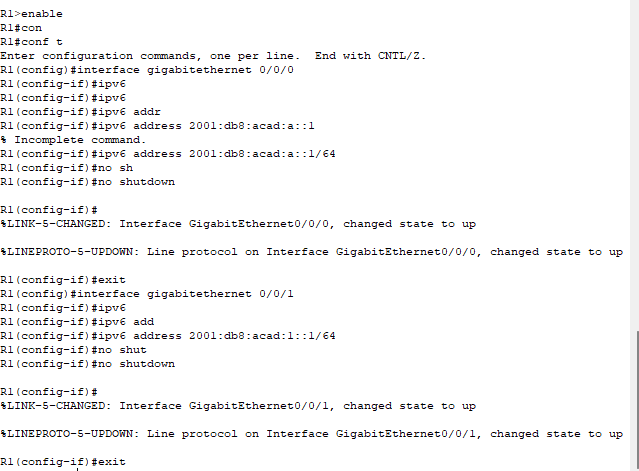**

**b.	Введите команду show ipv6 interface brief, чтобы проверить, назначен ли каждому интерфейсу корректный индивидуальный IPv6-адрес.**
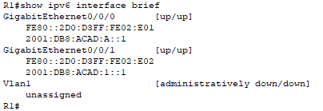

**c.	Чтобы обеспечить соответствие локальных адресов канала индивидуальному адресу, вручную введите локальные адреса канала на каждом интерфейсе Ethernet на R1.**
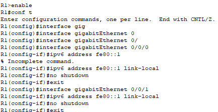

**d.	Используйте выбранную команду, чтобы убедиться, что локальный адрес связи изменен на fe80::1.  **

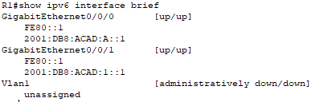

### Шаг 2. Активируйте IPv6-маршрутизацию на R1.

**a.	В командной строке на PC-B введите команду ipconfig, чтобы получить данные IPv6-адреса, назначенного интерфейсу ПК.**
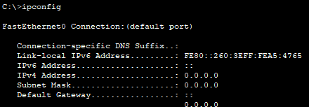

**b.	Активируйте IPv6-маршрутизацию на R1 с помощью команды IPv6 unicast-routing.**

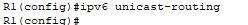

**c.	Теперь, когда R1 входит в группу многоадресной рассылки всех маршрутизаторов, еще раз введите команду ipconfig на PC-B. Проверьте данные IPv6-адреса.**

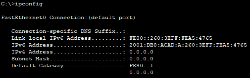

**Почему PC-B получил глобальный префикс маршрутизации и идентификатор подсети, которые вы настроили на R1?**

PC-B получил глобальный префикс маршрутизации и идентификатор подсети, настроенные на R1, потому что после включения команды:
*ipv6 unicast-routing* маршрутизатор R1 начал работать как IPv6-маршрутизатор и отправлять сообщения Router Advertisement (RA).

### Шаг 3. Назначьте IPv6-адреса интерфейсу управления (SVI) на S1.

**a.	Назначьте адрес IPv6 для S1. Также назначьте этому интерфейсу локальный адрес канала fe80::b.**

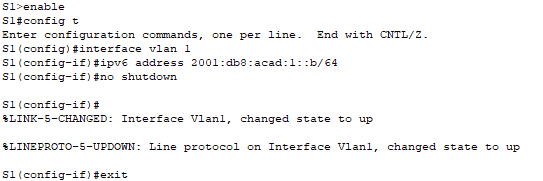

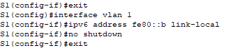

**b.	Проверьте правильность назначения IPv6-адресов интерфейсу управления с помощью команды show ipv6 interface vlan1.**

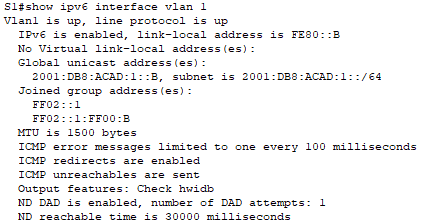

### Шаг 4. Назначьте компьютерам статические IPv6-адреса.

**a.	Откройте окно Свойства Ethernet для каждого ПК и назначьте адресацию IPv6.
Убедитесь, что оба компьютера имеют правильную информацию адреса IPv6
**
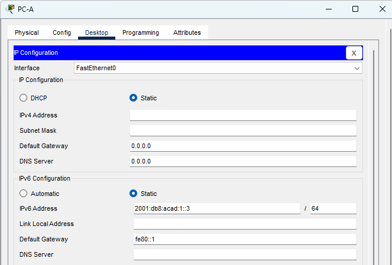
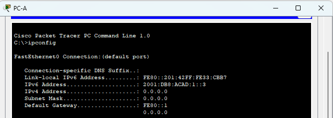

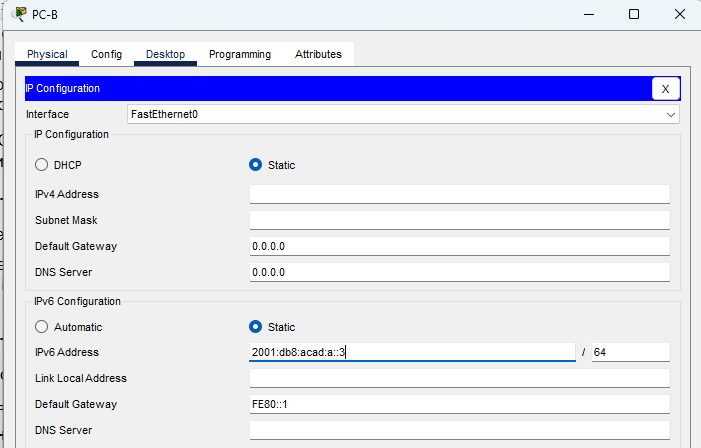
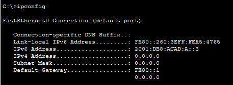

## Часть 3. Проверка сквозного подключения

**С PC-A отправьте эхо-запрос на FE80::1. Это локальный адрес канала, назначенный G0/1 на R1.**
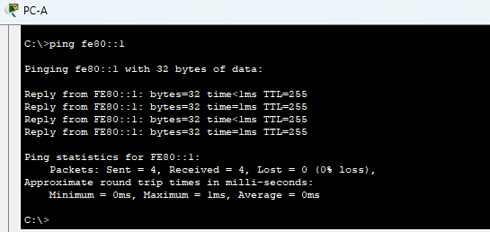

**Отправьте эхо-запрос на интерфейс управления S1 с PC-A.**
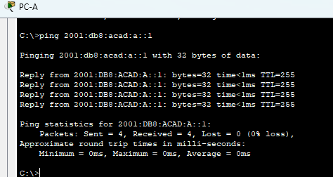

**Введите команду tracert на PC-A, чтобы проверить наличие сквозного подключения к PC-B.**
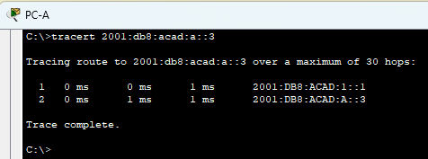

**С PC-B отправьте эхо-запрос на PC-A.**
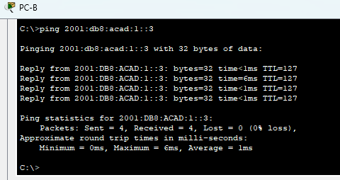

**С PC-B отправьте эхо-запрос на локальный адрес канала G0/0 на R1.**
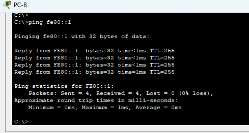

## Вопросы для повторения

**1.	Почему обоим интерфейсам Ethernet на R1 можно назначить один и тот же локальный адрес канала — FE80::1?**

**2.	Какой идентификатор подсети в индивидуальном IPv6-адресе 2001:db8:acad::aaaa:1234/64?**

Одинаковый link-local адрес FE80::1 можно назначить обоим Ethernet-интерфейсам R1, потому что локальные адреса канала IPv6 действуют только в пределах одного канала/сегмента сети. Они не маршрутизируются за пределы локального сегмента. Поэтому один и тот же link-local адрес может использоваться на разных интерфейсах одного маршрутизатора, если эти интерфейсы находятся в разных сетевых сегментах.

В IPv6-адресе 2001:db8:acad::aaaa:1234/64 префикс /64 означает, что первые 64 бита — это сетевая часть адреса 2001:db8:acad:0000
Здесь идентификатор подсети — это четвертый хекстет: 0000
То есть идентификатор подсети: 0