# Лабораторная работа. Настройка IPv6-адресов на сетевых устройствах 

## Топология

## Таблица адресации

## Часть 1. Настройка основных параметров устройств

### Шаг 3. Настройте маршрутизатор.
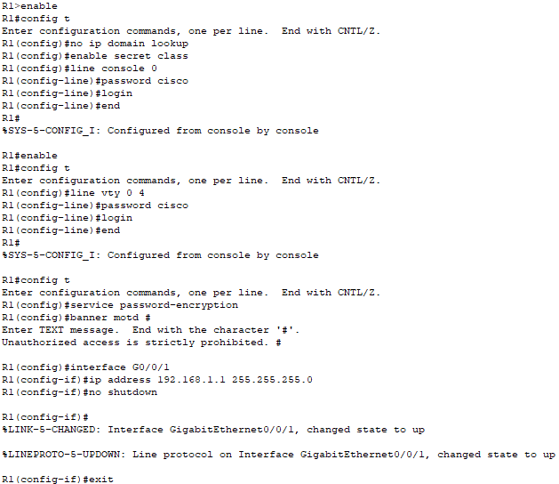
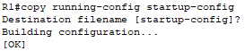
### Шаг 4. Настройте компьютер PC-A.
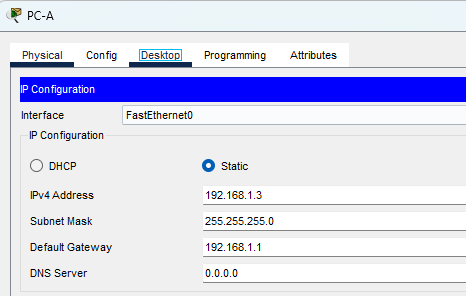
### Шаг 5. Проверьте подключение к сети.
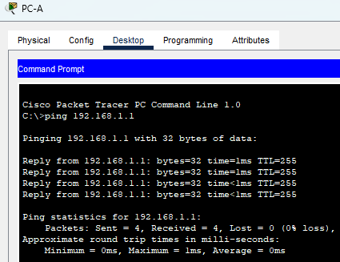
## Часть 2. Настройка маршрутизатора для доступа по протоколу SSH

### Шаг 1. Настройте аутентификацию устройств.
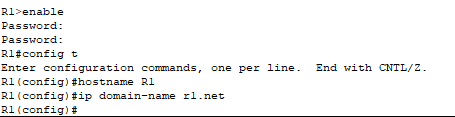
### Шаг 2. Создайте ключ шифрования с указанием его длины.
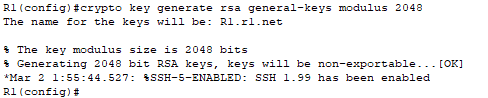
### Шаг 3. Создайте имя пользователя в локальной базе учетных записей.
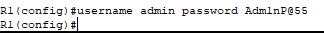
### Шаг 4. Активируйте протокол SSH на линиях VTY.
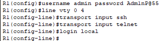
### Шаг 5. Сохраните текущую конфигурацию в файл загрузочной конфигурации.

### Шаг 6. Установите соединение с маршрутизатором по протоколу SSH.
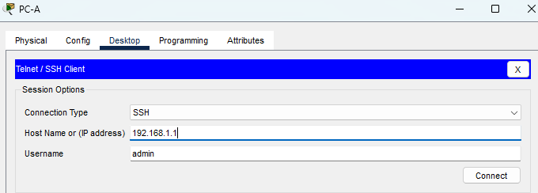
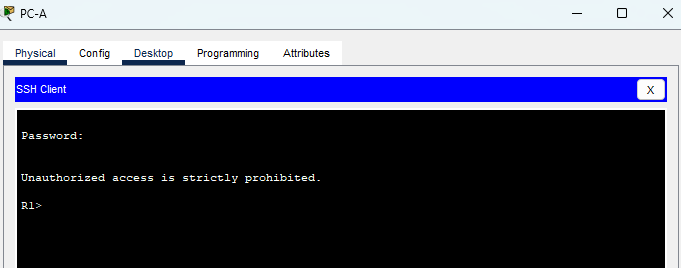
## Часть 3. Настройка коммутатора для доступа по протоколу SSH

### Шаг 1. Настройте основные параметры коммутатора.
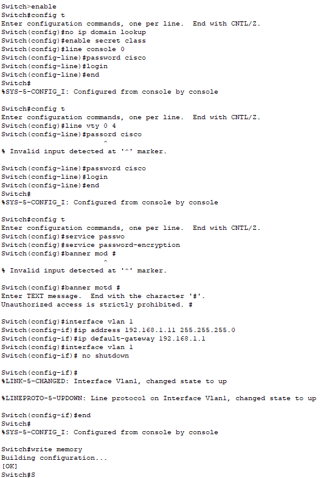
### Шаг 2. Настройте коммутатор для соединения по протоколу SSH.
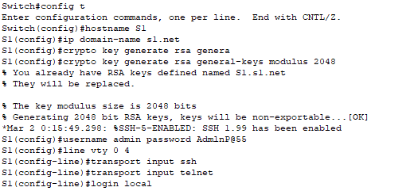
### Шаг 3. Установите соединение с коммутатором по протоколу SSH.
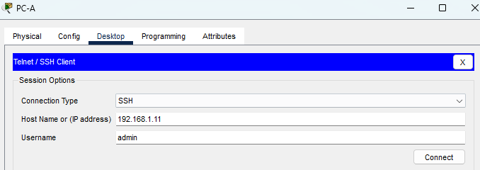
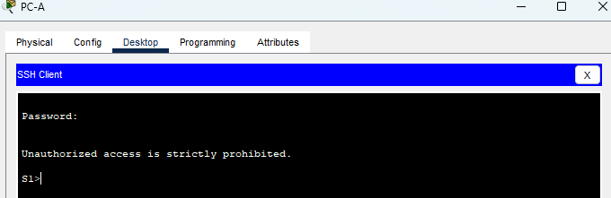
## Часть 4. Настройка протокола SSH с использованием интерфейса командной строки (CLI) коммутатора

### Шаг 1. Посмотрите доступные параметры для клиента SSH в Cisco IOS.
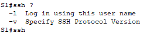
### Шаг 2. Установите с коммутатора S1 соединение с маршрутизатором R1 по протоколу SSH.

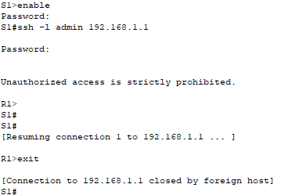

**Какие версии протокола SSH поддерживаются при использовании интерфейса командной строки?**

1.99 и 2

## 	Вопрос для повторения

Нужно создать несколько локальных пользователей на устройстве, а затем включить вход через локальную базу командой login local