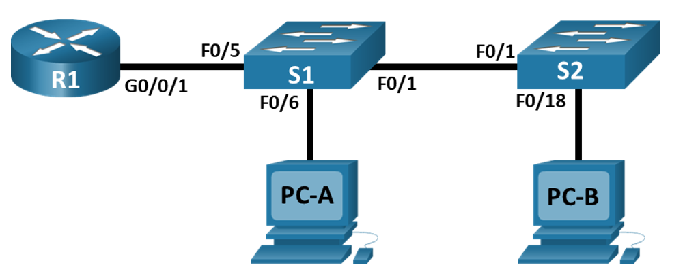
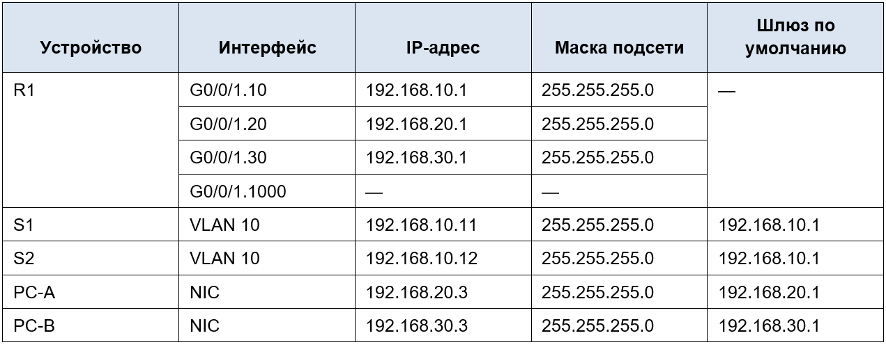
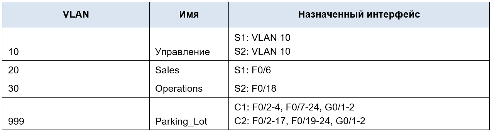

# Лабораторная работа. Настройка IPv6-адресов на сетевых устройствах 

## Топология

## Таблица адресации

## Таблица VLAN

## Часть 1. Создание сети и настройка основных параметров устройства

### Шаг 1. Создайте сеть согласно топологии.

### Шаг 2. Настройте базовые параметры для маршрутизатора.

### Шаг 3. Настройте базовые параметры каждого коммутатора.

### Шаг 4. Настройте узлы ПК.

## Часть 2. Создание сетей VLAN и назначение портов коммутатора

### Шаг 1. Создайте сети VLAN на коммутаторах.

### Шаг 2. Назначьте сети VLAN соответствующим интерфейсам коммутатора.

## Часть 3. Настройка транка 802.1Q между коммутаторами.

### Шаг 1. Вручную настройте магистральный интерфейс F0/1 на коммутаторах S1 и S2.

### Шаг 2. Вручную настройте магистральный интерфейс F0/5 на коммутаторе S1.

## Часть 4. Настройка маршрутизации между сетями VLAN

### Шаг 1. Настройте маршрутизатор.

## Часть 5. Проверка, что маршрутизация между VLAN работает

### Шаг 1. Выполните следующие тесты с PC-A. Все должно быть успешно.

### Шаг 2. Пройдите следующий тест с PC-B

