# Лабораторная работа. Настройка IPv6-адресов на сетевых устройствах 

## Топология

## Таблица адресации

## Таблица VLAN

## Часть 1. Создание сети и настройка основных параметров устройства

### Шаг 2. Настройте базовые параметры для маршрутизатора.

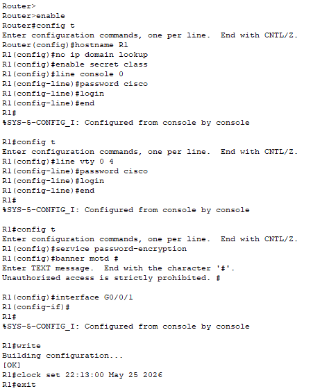

### Шаг 3. Настройте базовые параметры каждого коммутатора.

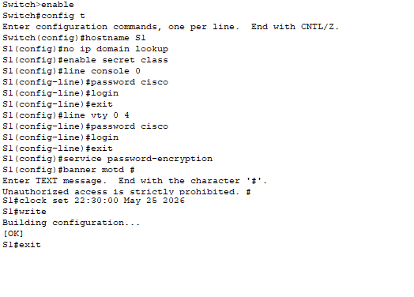

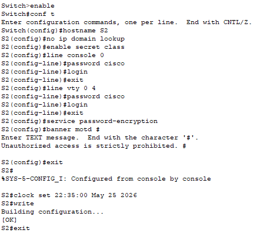

### Шаг 4. Настройте узлы ПК.

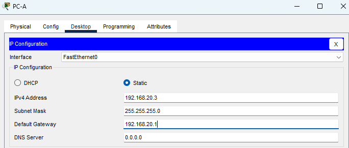

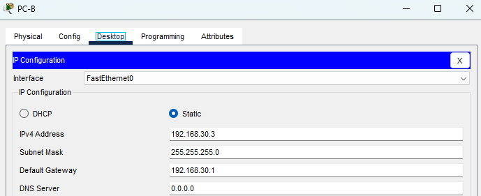

## Часть 2. Создание сетей VLAN и назначение портов коммутатора

### Шаг 1. Создайте сети VLAN на коммутаторах.

**a.	Создайте и назовите необходимые VLAN на каждом коммутаторе из таблицы выше.**

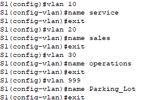

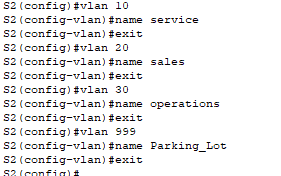

**b.	Настройте интерфейс управления и шлюз по умолчанию на каждом коммутаторе, используя информацию об IP-адресе в таблице адресации.**

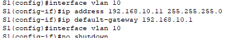

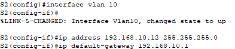

**c.	Назначьте все неиспользуемые порты коммутатора VLAN Parking_Lot, настройте их для статического режима доступа и административно деактивируйте их.**

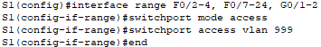

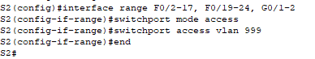

### Шаг 2. Назначьте сети VLAN соответствующим интерфейсам коммутатора.

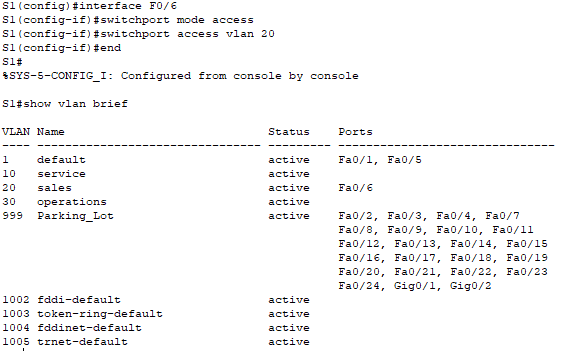

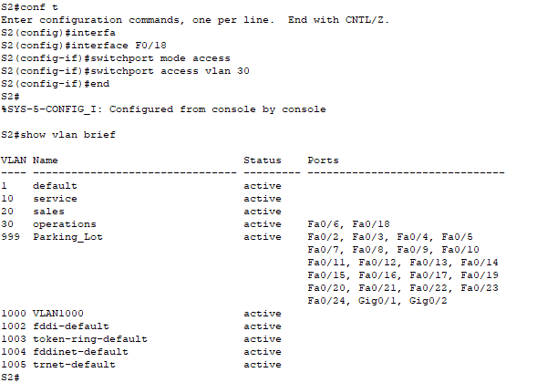

## Часть 3. Настройка транка 802.1Q между коммутаторами.

### Шаг 1. Вручную настройте магистральный интерфейс F0/1 на коммутаторах S1 и S2.

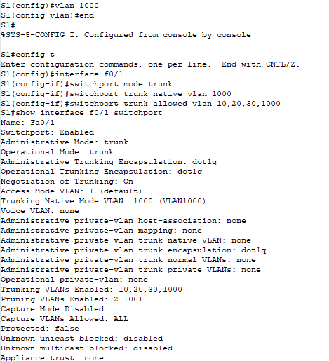

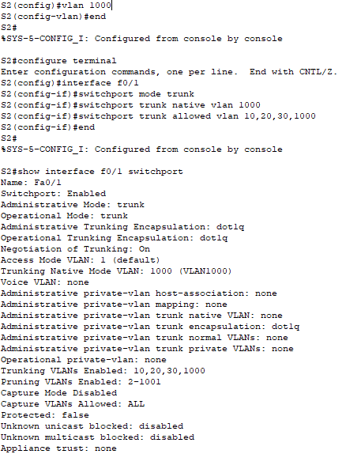

### Шаг 2. Вручную настройте магистральный интерфейс F0/5 на коммутаторе S1.

**Что произойдет, если G0/0/1 на R1 будет отключен?**

Не будет возможности настроить маршрутизацию между VLAN

## Часть 4. Настройка маршрутизации между сетями VLAN

### Шаг 1. Настройте маршрутизатор.

**a. При необходимости активируйте интерфейс G0/0/1 на маршрутизаторе.**

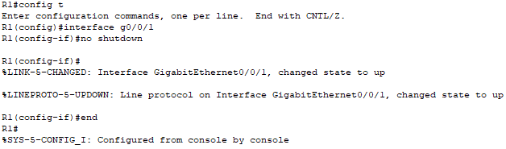

**b.	Настройте подинтерфейсы для каждой VLAN, как указано в таблице IP-адресации. Все подинтерфейсы используют инкапсуляцию 802.1Q. Убедитесь, что подинтерфейсу для native VLAN не назначен IP-адрес. Включите описание для каждого подинтерфейса.**

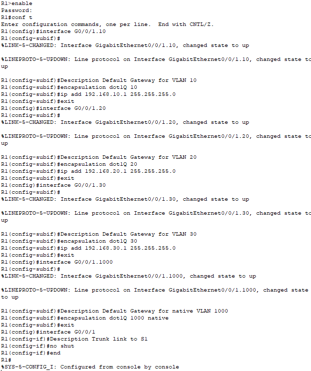

**c.	Убедитесь, что вспомогательные интерфейсы работают**

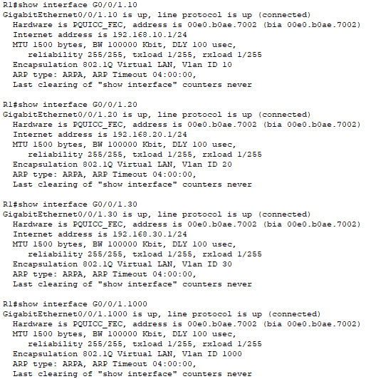

## Часть 5. Проверка, что маршрутизация между VLAN работает

### Шаг 1. Выполните следующие тесты с PC-A. Все должно быть успешно.

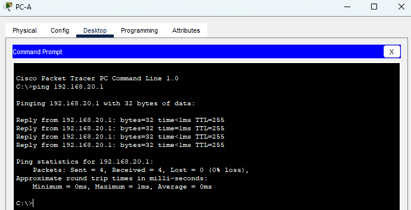

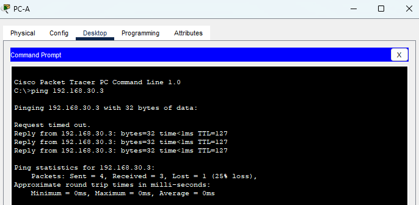

### Шаг 2. Пройдите следующий тест с PC-B

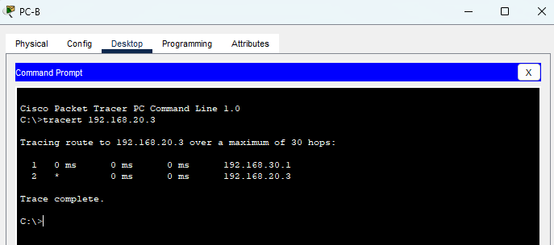

**Какие промежуточные IP-адреса отображаются в результатах?**

Адрес шлюза на роутере R1