# Лабораторная работа. Развертывание коммутируемой сети с резервными каналами

- [Лабораторная работа. Развертывание коммутируемой сети с резервными каналами](#лабораторная-работа-развертывание-коммутируемой-сети-с-резервными-каналами)
  - [Топология](#топология)
  - [Таблица адресации](#таблица-адресации)
  - [Часть 1:	Создание сети и настройка основных параметров устройства](#часть-1создание-сети-и-настройка-основных-параметров-устройства)
    - [Шаг 3:	Настройте базовые параметры каждого коммутатора.](#шаг-3настройте-базовые-параметры-каждого-коммутатора)
    - [Шаг 4:	Проверьте связь.](#шаг-4проверьте-связь)
  - [Часть 2:	Определение корневого моста](#часть-2определение-корневого-моста)
  - [Шаг 1: Отключите все порты на коммутаторах.](#шаг-1-отключите-все-порты-на-коммутаторах)
  - [Шаг 2: Настройте подключенные порты в качестве транковых.](#шаг-2-настройте-подключенные-порты-в-качестве-транковых)
  - [Шаг 3: Включите порты F0/2 и F0/4 на всех коммутаторах.](#шаг-3-включите-порты-f02-и-f04-на-всех-коммутаторах)
  - [Шаг 4:	Отобразите данные протокола spanning-tree.](#шаг-4отобразите-данные-протокола-spanning-tree)
  - [Часть 3:	Наблюдение за процессом выбора протоколом STP порта, исходя из стоимости портов](#часть-3наблюдение-за-процессом-выбора-протоколом-stp-порта-исходя-из-стоимости-портов)
    - [Шаг 1:	Определите коммутатор с заблокированным портом.](#шаг-1определите-коммутатор-с-заблокированным-портом)
    - [Шаг 2:	Измените стоимость порта.](#шаг-2измените-стоимость-порта)
    - [Шаг 3:	Просмотрите изменения протокола spanning-tree.](#шаг-3просмотрите-изменения-протокола-spanning-tree)
    - [Шаг 4:	Удалите изменения стоимости порта.](#шаг-4удалите-изменения-стоимости-порта)
  - [Часть 4:	Наблюдение за процессом выбора протоколом STP порта, исходя из приоритета портов](#часть-4наблюдение-за-процессом-выбора-протоколом-stp-порта-исходя-из-приоритета-портов)
    - [Вопросы для повторения](#вопросы-для-повторения)

## Топология

## Таблица адресации

## Часть 1:	Создание сети и настройка основных параметров устройства

### Шаг 3:	Настройте базовые параметры каждого коммутатора.

### Шаг 4:	Проверьте связь.

## Часть 2:	Определение корневого моста

## Шаг 1: Отключите все порты на коммутаторах.

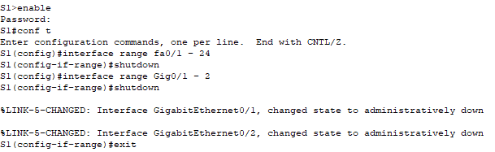

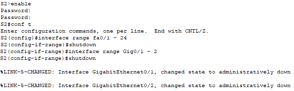

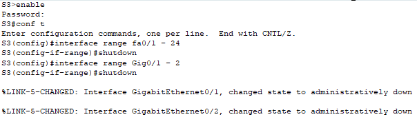

## Шаг 2: Настройте подключенные порты в качестве транковых.

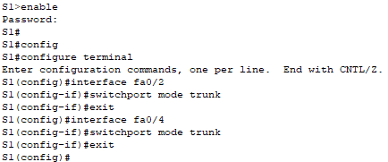

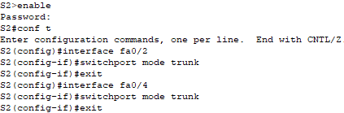

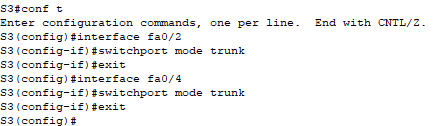

## Шаг 3: Включите порты F0/2 и F0/4 на всех коммутаторах.

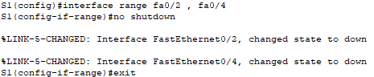

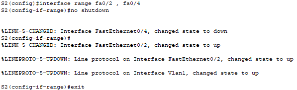

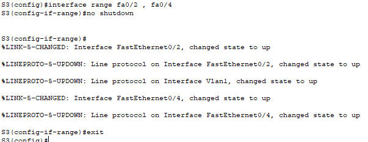

## Шаг 4:	Отобразите данные протокола spanning-tree.

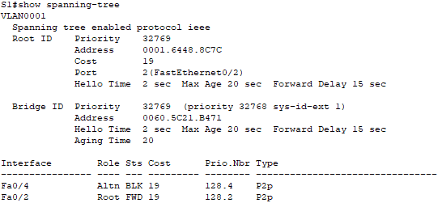

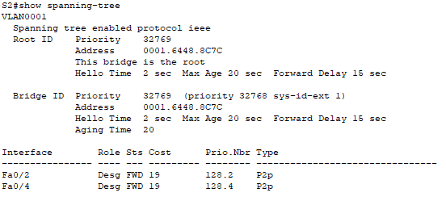

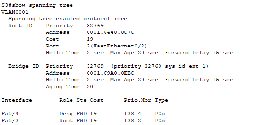

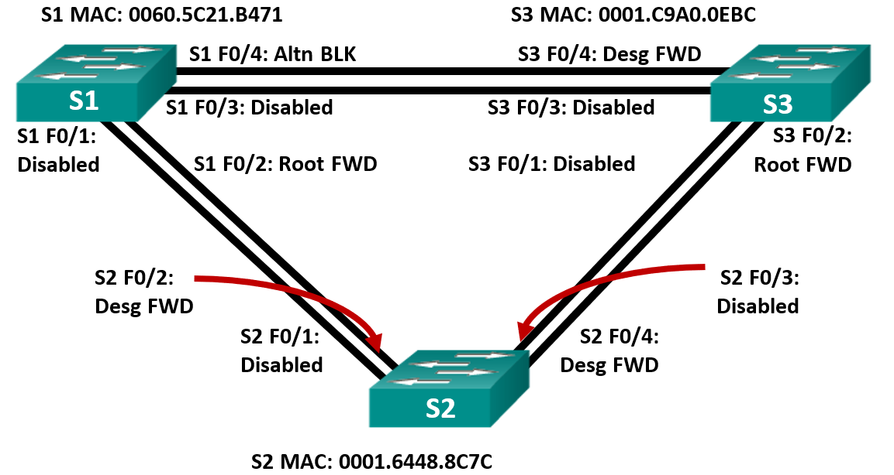

**Какой коммутатор является корневым мостом?**

Корневой мост — S2.

**Почему этот коммутатор был выбран протоколом spanning-tree в качестве корневого моста?**

Потому что у него наименьший Bridge ID среди всех коммутаторов.
У всех коммутаторов одинаковая приоритетная часть 32769, поэтому решает MAC-адрес. У S2 MAC 0001.6448.8C7C, и он меньше, чем у S1 и S3

**Какие порты на коммутаторе являются корневыми портами?** 

S1 Fa0/2
S3 Fa0/2

Это порты с наименьшей стоимостью пути до корневого моста.

**Какие порты на коммутаторе являются назначенными портами?** 

S2 Fa0/2
S2 Fa0/4
S3 Fa0/4

(designated)

**Какой порт отображается в качестве альтернативного и в настоящее время заблокирован?** 

S1 Fa0/4

(Altn BLK)

**Почему протокол spanning-tree выбрал этот порт в качестве невыделенного (заблокированного) порта?**

Потому что между S1 и S3 уже есть другой более выгодный путь.
У S1 и S3 одинаковая стоимость пути до root через Fa0/2, поэтому S3 Fa0/4 выбран как designated, а S1 Fa0/4 сделан альтернативным и заблокирован, чтобы не было петли.

## Часть 3:	Наблюдение за процессом выбора протоколом STP порта, исходя из стоимости портов

### Шаг 1:	Определите коммутатор с заблокированным портом.

Порт Fa0/4 на коммутаторе S1 имеет роль Alternate (Altn) и находится в состоянии Blocking (BLK).

### Шаг 2:	Измените стоимость порта.

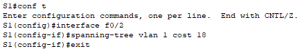

### Шаг 3:	Просмотрите изменения протокола spanning-tree.

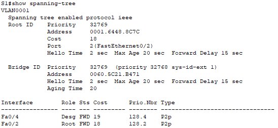

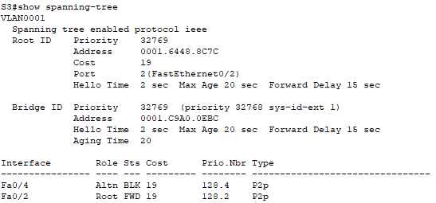

### Шаг 4:	Удалите изменения стоимости порта.

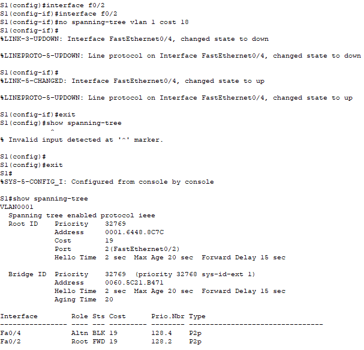

## Часть 4:	Наблюдение за процессом выбора протоколом STP порта, исходя из приоритета портов

**a.	Включите порты F0/1 и F0/3 на всех коммутаторах.**

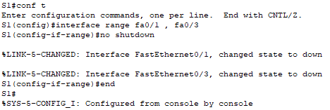

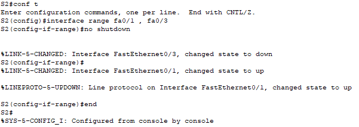

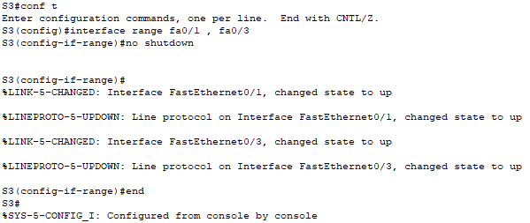

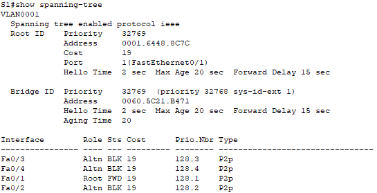

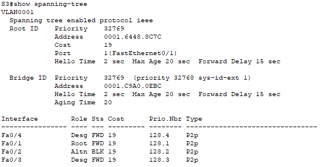

На коммутаторе S1 корневым портом выбран Fa0/1, на S3 — Fa0/1. Протокол STP выбрал эти порты, потому что все пути имели одинаковую стоимость, а при равных стоимостях и одинаковом root bridge решающим оказался Port ID. Порт Fa0/1 имеет наименьший номер и наименьший Prio.Nbr - 128.1, поэтому он был признан лучшим путём к корневому мосту.

### Вопросы для повторения
**1.	Какое значение протокол STP использует первым после выбора корневого моста, чтобы определить выбор порта?**

Root Path Cost

**2.	Если первое значение на двух портах одинаково, какое следующее значение будет использовать протокол STP при выборе порта?**

Bridge ID

**3.	Если оба значения на двух портах равны, каким будет следующее значение, которое использует протокол STP при выборе порта?**

Port ID
