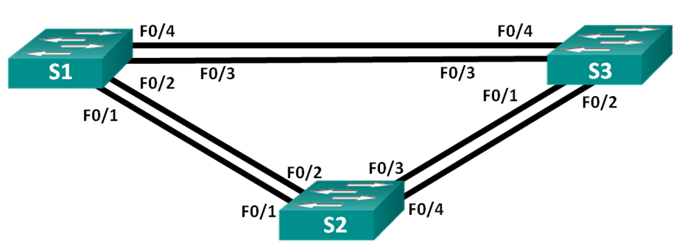
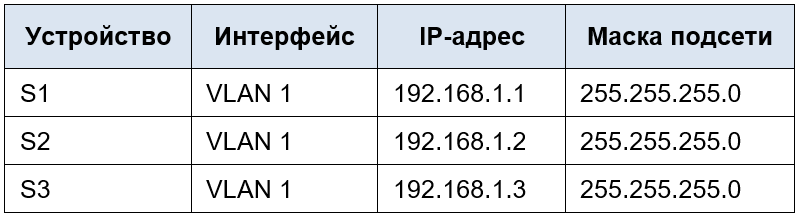
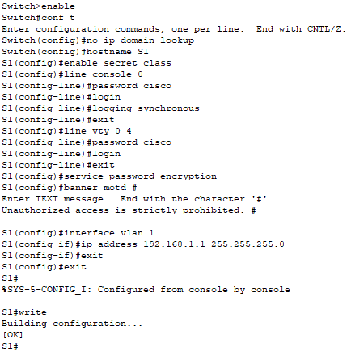
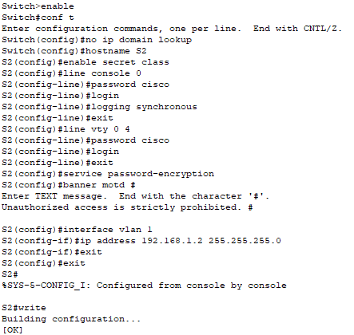
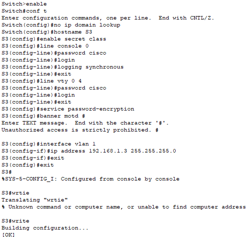
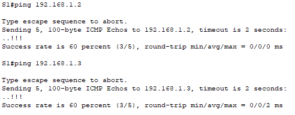
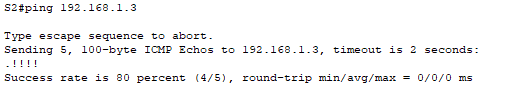

# Лабораторная работа. Развертывание коммутируемой сети с резервными каналами

## Топология

## Таблица адресации

## Часть 1:	Создание сети и настройка основных параметров устройства

### Шаг 3:	Настройте базовые параметры каждого коммутатора.

### Шаг 4:	Проверьте связь.

## Часть 2:	Определение корневого моста

## Шаг 1-3

## Шаг 4:	Отобразите данные протокола spanning-tree.

Какой коммутатор является корневым мостом? 

Почему этот коммутатор был выбран протоколом spanning-tree в качестве корневого моста?

Какие порты на коммутаторе являются корневыми портами? 

Какие порты на коммутаторе являются назначенными портами? 

Какой порт отображается в качестве альтернативного и в настоящее время заблокирован? 

Почему протокол spanning-tree выбрал этот порт в качестве невыделенного (заблокированного) порта?

## Часть 3:	Наблюдение за процессом выбора протоколом STP порта, исходя из стоимости портов

### Шаг 1:	Определите коммутатор с заблокированным портом.

### Шаг 2:	Измените стоимость порта.

### Шаг 3:	Просмотрите изменения протокола spanning-tree.

### Шаг 4:	Удалите изменения стоимости порта.

## Часть 4:	Наблюдение за процессом выбора протоколом STP порта, исходя из приоритета портов

### Вопросы для повторения
1.	Какое значение протокол STP использует первым после выбора корневого моста, чтобы определить выбор порта?

2.	Если первое значение на двух портах одинаково, какое следующее значение будет использовать протокол STP при выборе порта?

3.	Если оба значения на двух портах равны, каким будет следующее значение, которое использует протокол STP при выборе порта?

