# Лабораторная работа - Реализация DHCPv4 

## Топология

## Таблица адресации

## Таблица VLAN

## Часть 1.	Создание сети и настройка основных параметров устройства

### Шаг 1.	Создание схемы адресации

Таблица адресации заполнена в соответствии с заданием.

### Шаг 4.	Настройка маршрутизации между сетями VLAN на маршрутизаторе R1

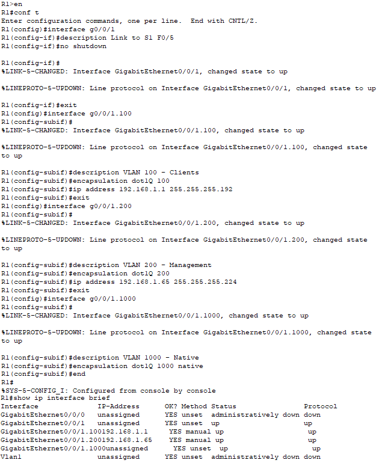

### Шаг 5.	Настройте G0/1 на R2, затем G0/0/0 и статическую маршрутизацию для обоих маршрутизаторов

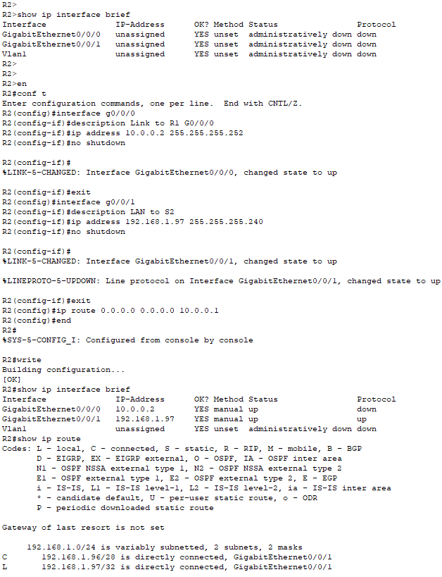

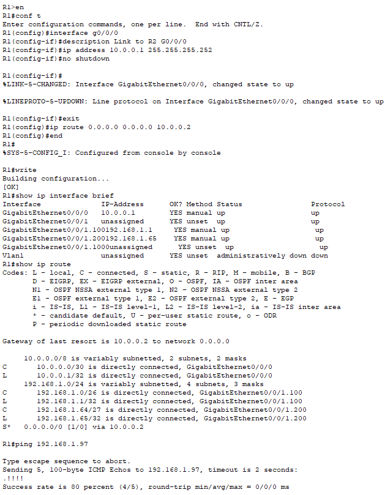

### Шаг 7.	Создайте сети VLAN на коммутаторе S1.

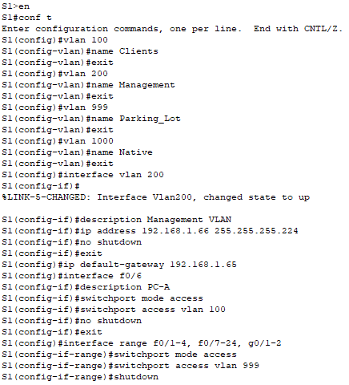

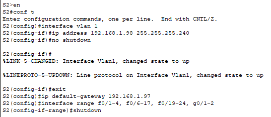

### Шаг 8.	Назначьте сети VLAN соответствующим интерфейсам коммутатора.

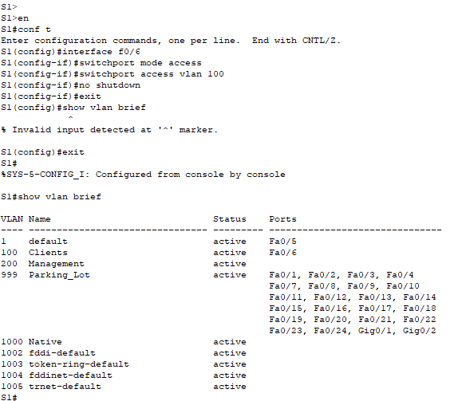

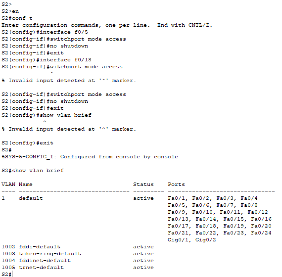

**Почему интерфейс F0/5 указан в VLAN 1?**

Потому что по умолчанию все access-порты коммутатора находятся в VLAN 1 если им не назначен другой VLAN

### Шаг 9.	Вручную настройте интерфейс S1 F0/5 в качестве транка 802.1Q.

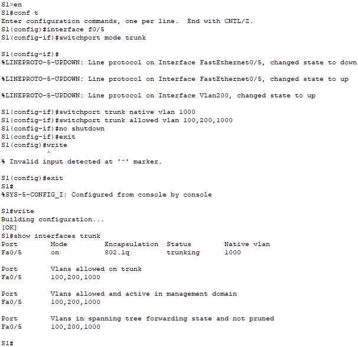

**Какой IP-адрес был бы у ПК, если бы он был подключен к сети с помощью DHCP?**

Адрес из диапазона 169.254.0.0/16, т.к. DHCP-сервер ещё не настроен и клиент не может получить адрес автоматически из нужной подсети.

## Часть 2.	Настройка и проверка двух серверов DHCPv4 на R1

### Шаг 1.	Настройте R1 с пулами DHCPv4 для двух поддерживаемых подсетей. 

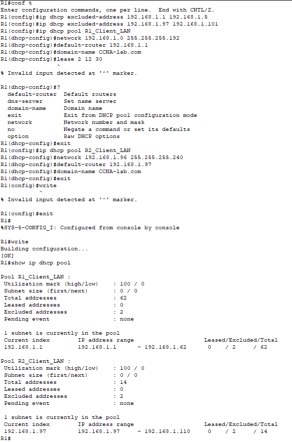

### Шаг 4.	Попытка получить IP-адрес от DHCP на PC-A

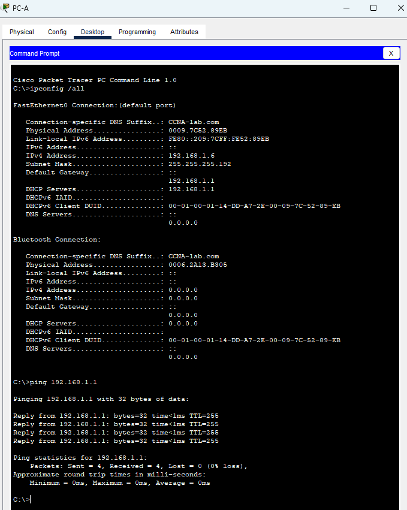

## Часть 3.	Настройка и проверка DHCP-ретрансляции на R2

### Шаг 1.	Настройка R2 в качестве агента DHCP-ретрансляции для локальной сети на G0/0/1

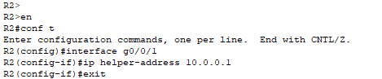

### Шаг 2.	Попытка получить IP-адрес от DHCP на PC-B

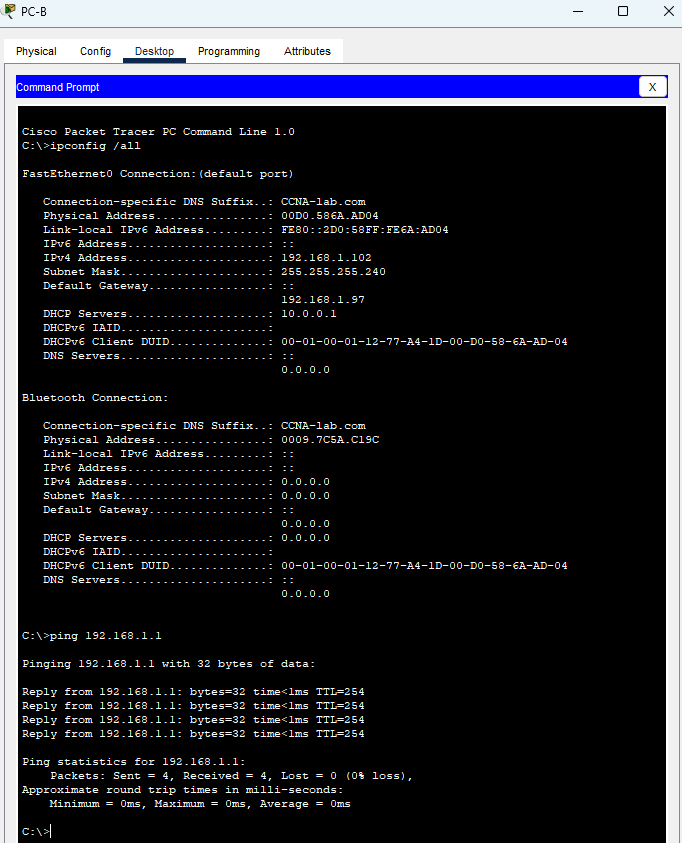
