# Лабраторная работа - Настройка DHCPv6

- [Лабраторная работа - Настройка DHCPv6](#лабраторная-работа---настройка-dhcpv6)
  - [Топология](#топология)
  - [Таблица адресации](#таблица-адресации)
  - [Часть 1. Создание сети и настройка основных параметров устройства](#часть-1-создание-сети-и-настройка-основных-параметров-устройства)
    - [Шаг 4. Настройка интерфейсов и маршрутизации для обоих маршрутизаторов.](#шаг-4-настройка-интерфейсов-и-маршрутизации-для-обоих-маршрутизаторов)
  - [Часть 2. Проверка назначения адреса SLAAC от R1](#часть-2-проверка-назначения-адреса-slaac-от-r1)
  - [Часть 3. Настройка и проверка сервера DHCPv6 на R1](#часть-3-настройка-и-проверка-сервера-dhcpv6-на-r1)
    - [Шаг 1. Более подробно изучите конфигурацию PC-A.](#шаг-1-более-подробно-изучите-конфигурацию-pc-a)
    - [Шаг 2. Настройте R1 для предоставления DHCPv6 без состояния для PC-A.](#шаг-2-настройте-r1-для-предоставления-dhcpv6-без-состояния-для-pc-a)
  - [Часть 4. Настройка сервера DHCPv6 с сохранением состояния на R1](#часть-4-настройка-сервера-dhcpv6-с-сохранением-состояния-на-r1)
  - [Часть 5. Настройка и проверка ретрансляции DHCPv6 на R2.](#часть-5-настройка-и-проверка-ретрансляции-dhcpv6-на-r2)
    - [Шаг 1. Включите PC-B и проверьте адрес SLAAC, который он генерирует.](#шаг-1-включите-pc-b-и-проверьте-адрес-slaac-который-он-генерирует)
    - [Шаг 2. Настройте R2 в качестве агента DHCP-ретрансляции для локальной сети на G0/0/1.](#шаг-2-настройте-r2-в-качестве-агента-dhcp-ретрансляции-для-локальной-сети-на-g001)
    - [Шаг 3. Попытка получить адрес IPv6 из DHCPv6 на PC-B.](#шаг-3-попытка-получить-адрес-ipv6-из-dhcpv6-на-pc-b)

## Топология

## Таблица адресации

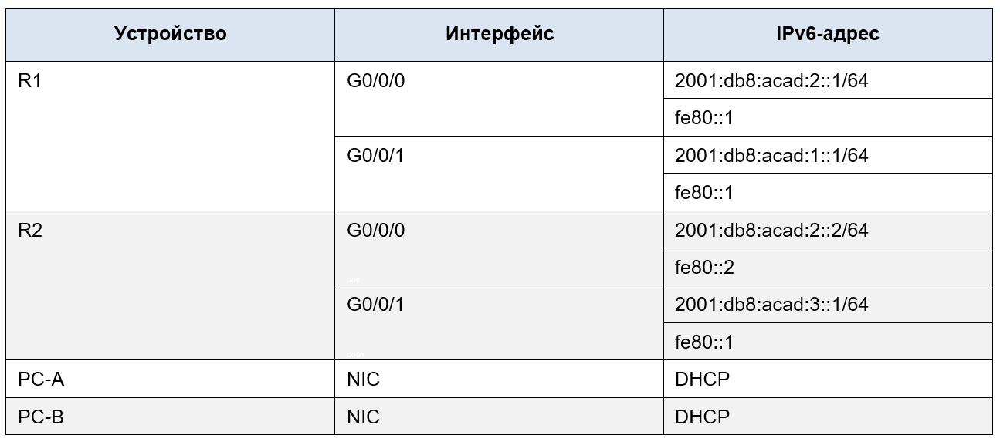

## Часть 1. Создание сети и настройка основных параметров устройства

### Шаг 4. Настройка интерфейсов и маршрутизации для обоих маршрутизаторов.

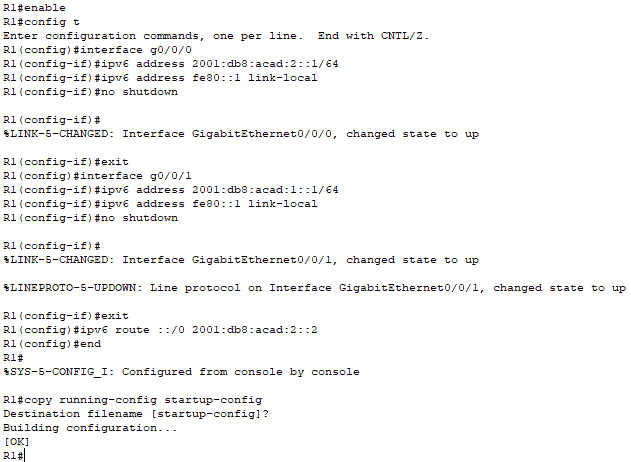

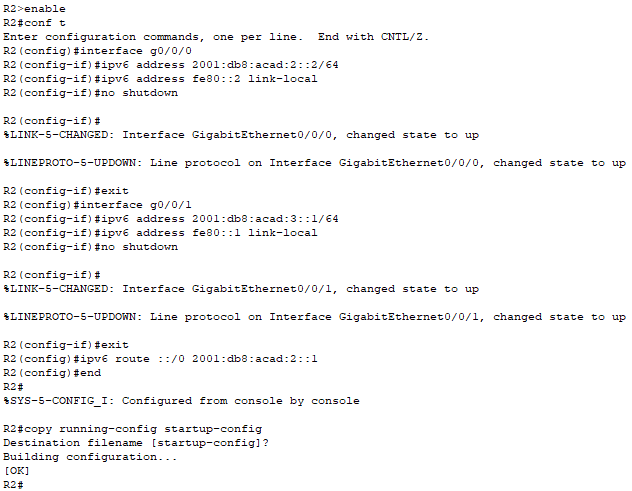

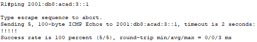

## Часть 2. Проверка назначения адреса SLAAC от R1

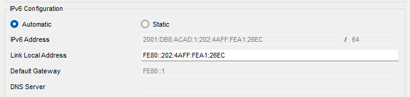

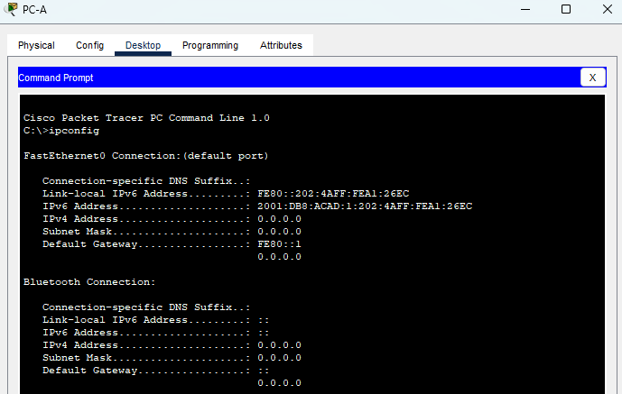

## Часть 3. Настройка и проверка сервера DHCPv6 на R1

### Шаг 1. Более подробно изучите конфигурацию PC-A.

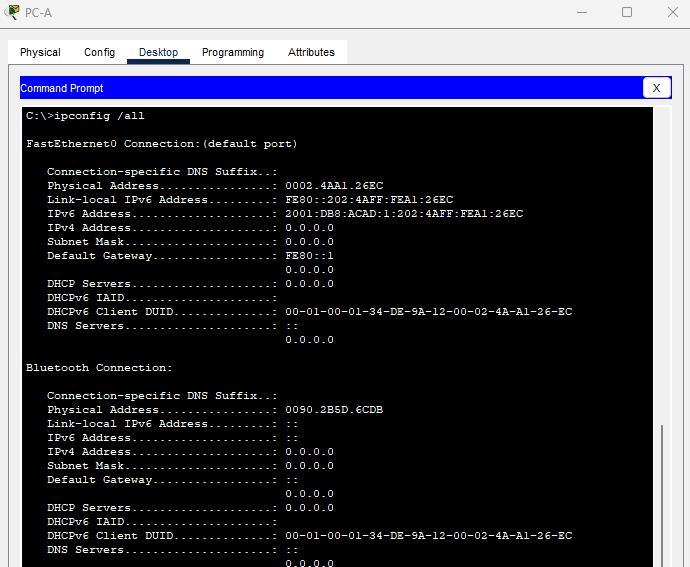

### Шаг 2. Настройте R1 для предоставления DHCPv6 без состояния для PC-A.

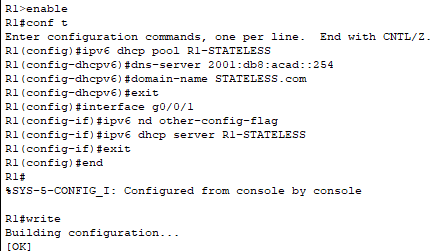

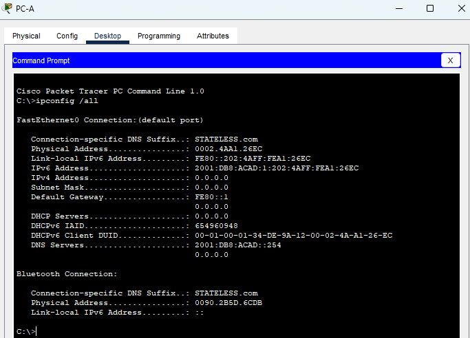

## Часть 4. Настройка сервера DHCPv6 с сохранением состояния на R1

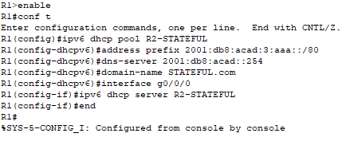

## Часть 5. Настройка и проверка ретрансляции DHCPv6 на R2.

### Шаг 1. Включите PC-B и проверьте адрес SLAAC, который он генерирует.

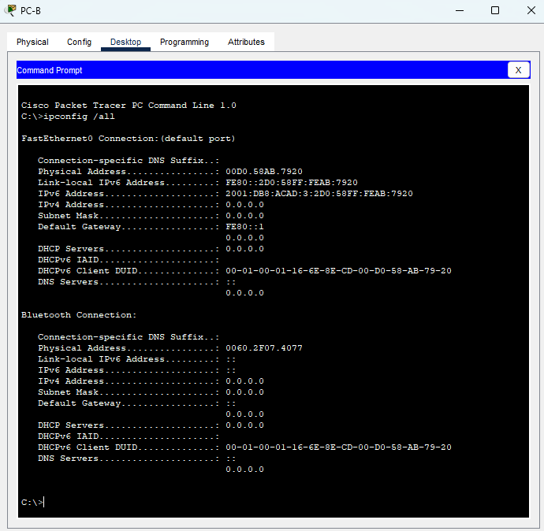

### Шаг 2. Настройте R2 в качестве агента DHCP-ретрансляции для локальной сети на G0/0/1.

В Cisco Packet Tracer версии 8.2.2 нет возможности задать ipv6 dhcp relay

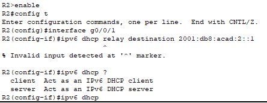

Поэтому на R2 настроен собственный DNS сервер

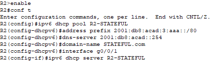

### Шаг 3. Попытка получить адрес IPv6 из DHCPv6 на PC-B.

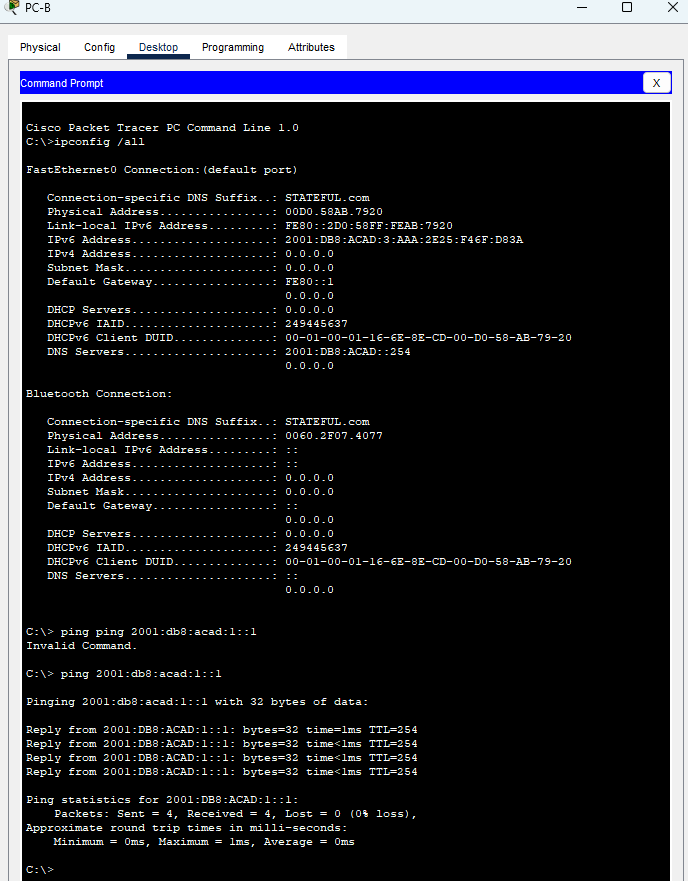