# Лабораторная работа - Конфигурация безопасности коммутатора

- [Лабораторная работа - Конфигурация безопасности коммутатора](#лабораторная-работа---конфигурация-безопасности-коммутатора)
  - [Топология](#топология)
  - [Таблица адресации](#таблица-адресации)
  - [Часть 1. Настройка основного сетевого устройства](#часть-1-настройка-основного-сетевого-устройства)
    - [Шаг 2. Настройте маршрутизатор R1.](#шаг-2-настройте-маршрутизатор-r1)
    - [Шаг 3. Настройка и проверка основных параметров коммутатора](#шаг-3-настройка-и-проверка-основных-параметров-коммутатора)
  - [Часть 2. Настройка сетей VLAN на коммутаторах.](#часть-2-настройка-сетей-vlan-на-коммутаторах)
  - [Часть 3. Настройки безопасности коммутатора.](#часть-3-настройки-безопасности-коммутатора)
    - [Шаг 1. Релизация магистральных соединений 802.1Q.](#шаг-1-релизация-магистральных-соединений-8021q)
    - [Шаг 2. Настройка портов доступа](#шаг-2-настройка-портов-доступа)
    - [Шаг 3. Безопасность неиспользуемых портов коммутатора](#шаг-3-безопасность-неиспользуемых-портов-коммутатора)
    - [Шаг 4. Документирование и реализация функций безопасности порта.](#шаг-4-документирование-и-реализация-функций-безопасности-порта)
    - [Шаг 5. Реализовать безопасность DHCP snooping.](#шаг-5-реализовать-безопасность-dhcp-snooping)
    - [Шаг 6. Реализация PortFast и BPDU Guard](#шаг-6-реализация-portfast-и-bpdu-guard)
    - [Шаг 7. Проверьте наличие сквозного подключения.](#шаг-7-проверьте-наличие-сквозного-подключения)
  - [Вопросы для повторения](#вопросы-для-повторения)

## Топология

## Таблица адресации

## Часть 1. Настройка основного сетевого устройства

### Шаг 2. Настройте маршрутизатор R1.

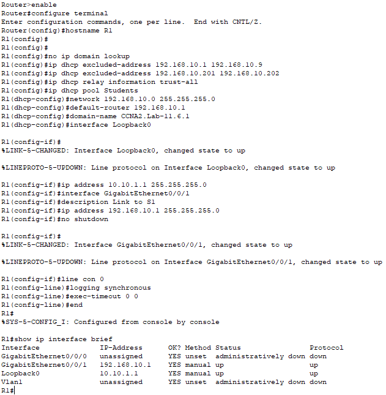

### Шаг 3. Настройка и проверка основных параметров коммутатора

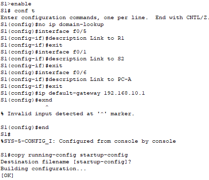

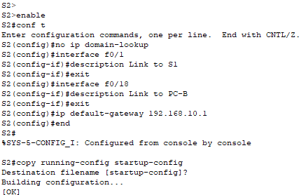

## Часть 2. Настройка сетей VLAN на коммутаторах.

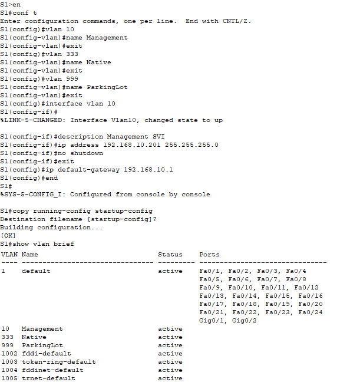

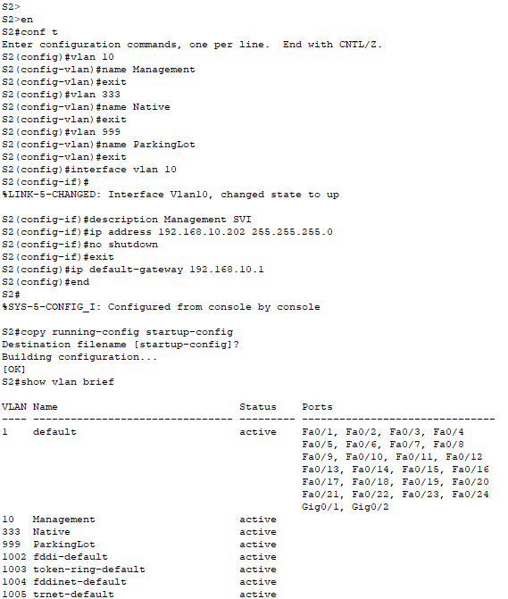

## Часть 3. Настройки безопасности коммутатора.

### Шаг 1. Релизация магистральных соединений 802.1Q.

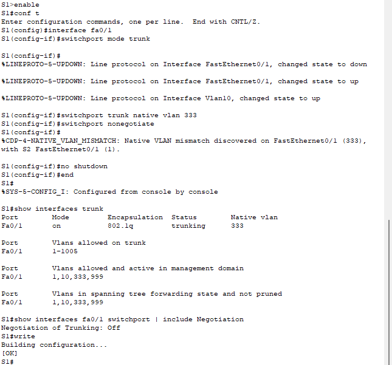

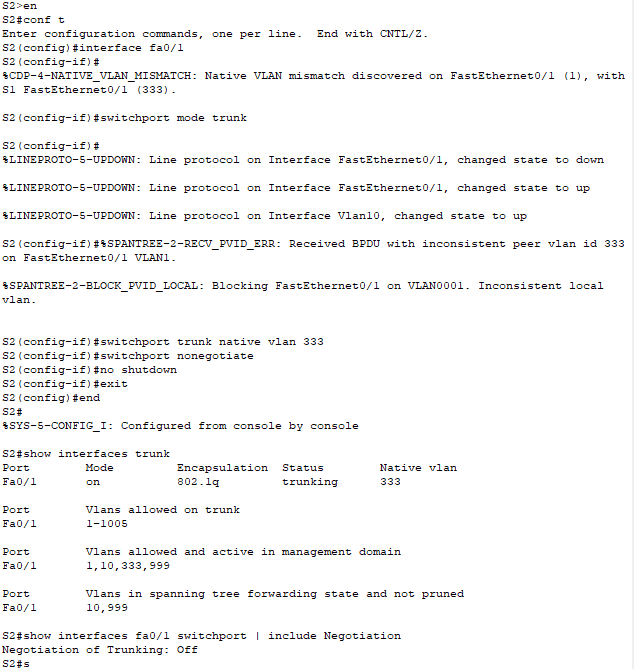

### Шаг 2. Настройка портов доступа

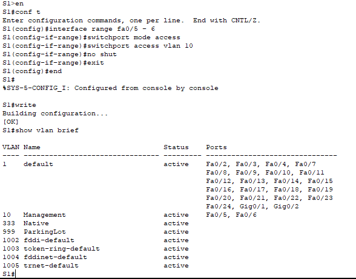

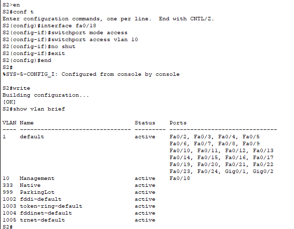

### Шаг 3. Безопасность неиспользуемых портов коммутатора

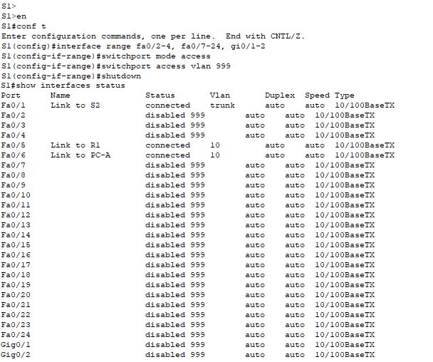

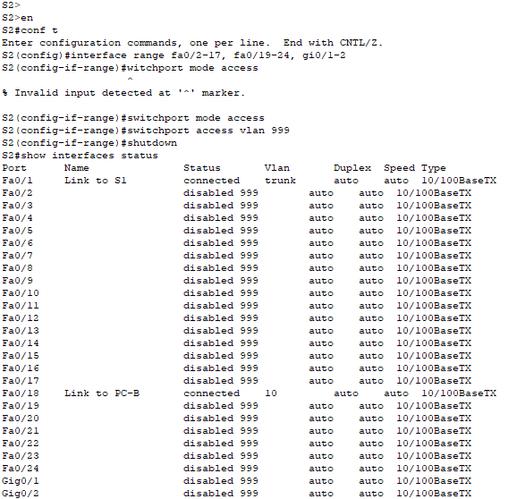

### Шаг 4. Документирование и реализация функций безопасности порта.

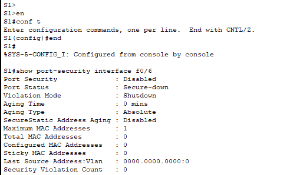

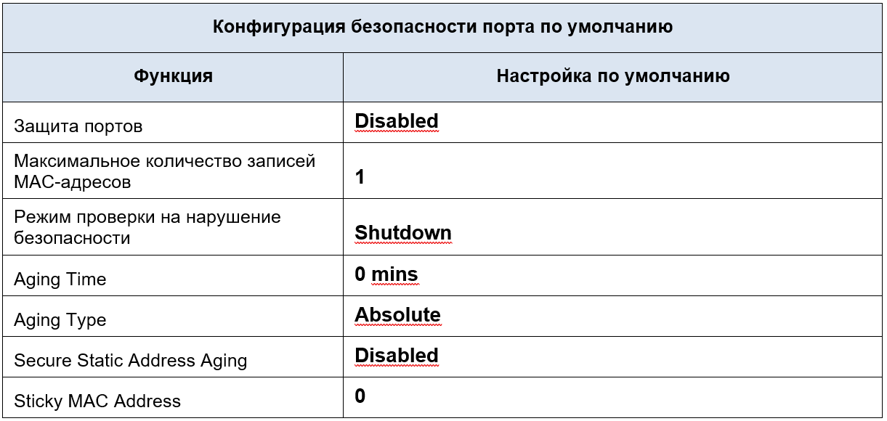

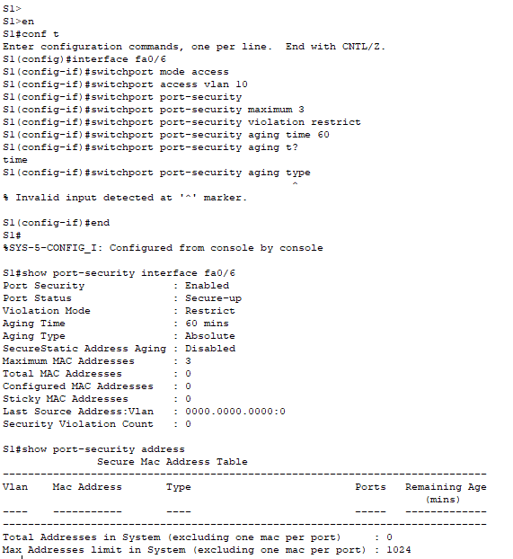

Примечание: в CPT невозможно прописать команду switchport port-security aging inactivity т.к. отсутсвует такой параметр.

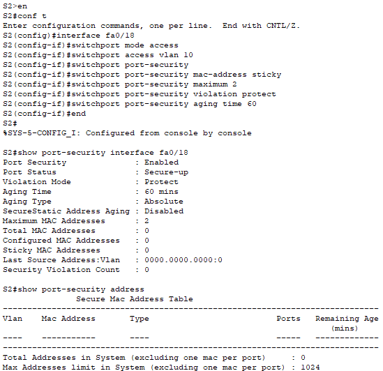

### Шаг 5. Реализовать безопасность DHCP snooping.

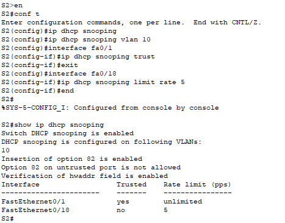

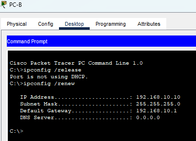

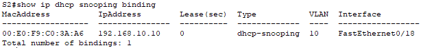

### Шаг 6. Реализация PortFast и BPDU Guard

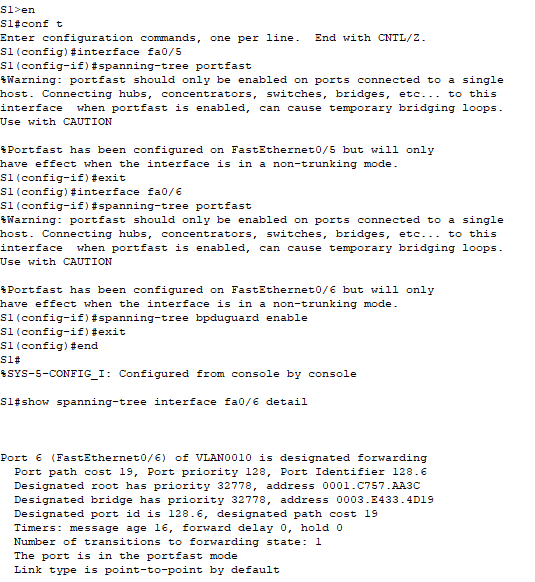

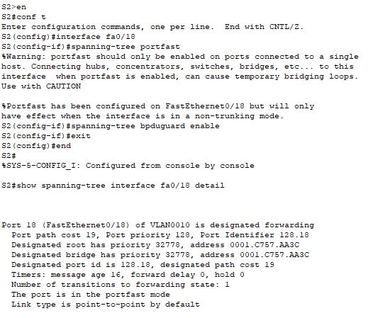

### Шаг 7. Проверьте наличие сквозного подключения.

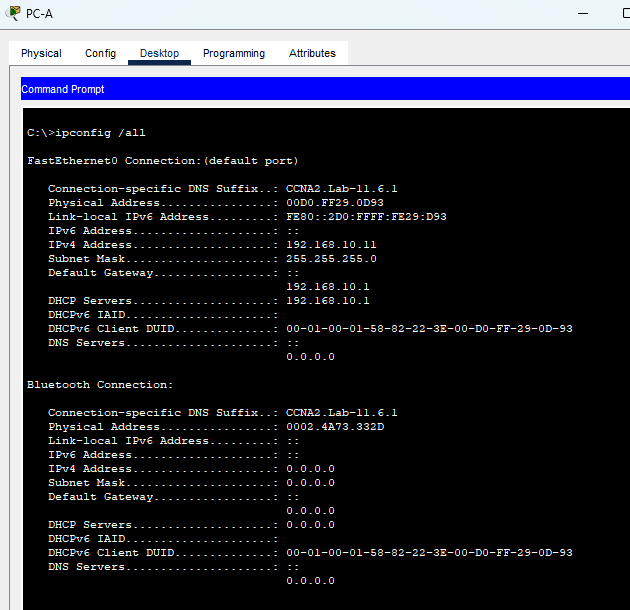

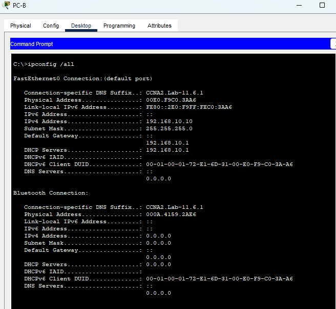

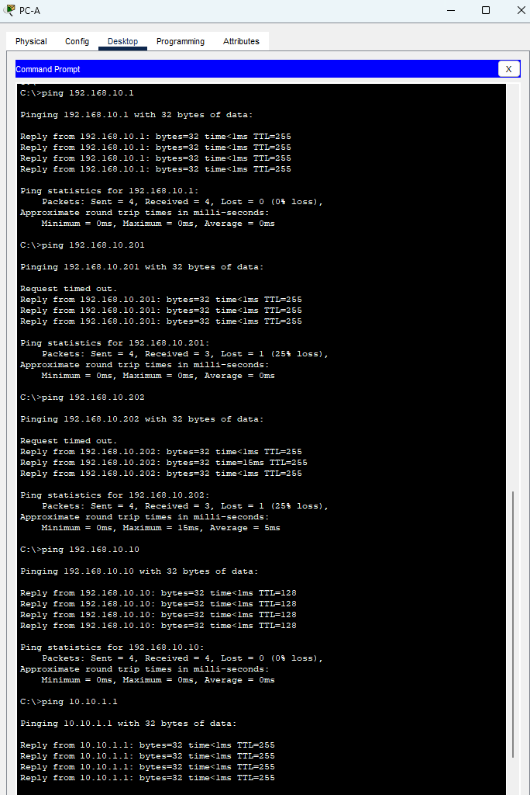

## Вопросы для повторения

**1.	С точки зрения безопасности порта на S2, почему нет значения таймера для оставшегося возраста в минутах, когда было сконфигурировано динамическое обучение - sticky?**

Потому что таймер не применяется к sticky адресам

**2.	Что касается безопасности порта на S2, если вы загружаете скрипт текущей конфигурации на S2, почему порту 18 на PC-B никогда не получит IP-адрес через DHCP?**

Потому что на 18 порту установлена настройка switchport port-security maximum 2.
В загружаемом конфиге к порту могут быть привязанны ранее полученные sticky MAC адреса. Если MAC в текущем конфиге PC-B отличается он не будет принят из-за ограничения в 2 адреса.

**3.	Что касается безопасности порта, в чем разница между типом абсолютного устаревания и типом устаревание по неактивности?**

При абсолютном типе MAC будет удален по истечении заданного интервала таймера.
При устаревании по неактивности MAC будет удален при отсуствия трафика по истечению заданного интервала.