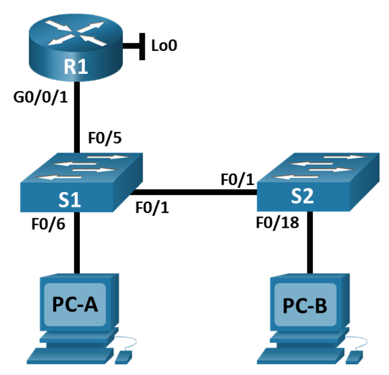
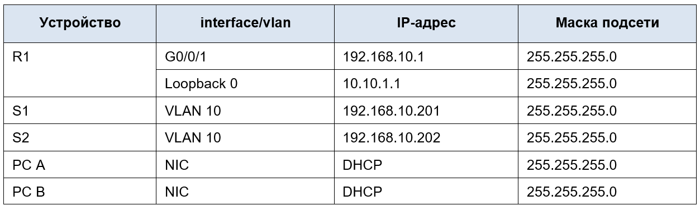

# Лабораторная работа - Конфигурация безопасности коммутатора

## Топология

## Таблица адресации

## Часть 1. Настройка основного сетевого устройства

### Шаг 2. Настройте маршрутизатор R1.

### Шаг 3. Настройка и проверка основных параметров коммутатора

## Часть 2. Настройка сетей VLAN на коммутаторах.

### Шаг 1. Сконфигруриуйте VLAN 10.

### Шаг 2. Сконфигруриуйте SVI для VLAN 10.

### Шаг 3. Настройте VLAN 333 с именем Native на S1 и S2.

### Шаг 4. Настройте VLAN 999 с именем ParkingLot на S1 и S2.

## Часть 3. Настройки безопасности коммутатора.

### Шаг 1. Релизация магистральных соединений 802.1Q.

### Шаг 2. Настройка портов доступа

### Шаг 3. Безопасность неиспользуемых портов коммутатора

### Шаг 4. Документирование и реализация функций безопасности порта.

### Шаг 5. Реализовать безопасность DHCP snooping.

### Шаг 6. Реализация PortFast и BPDU Guard

### Шаг 7. Проверьте наличие сквозного подключения.

## Вопросы для повторения