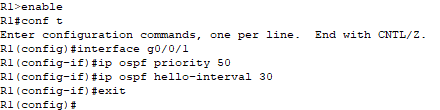
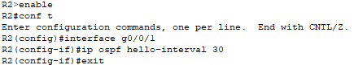
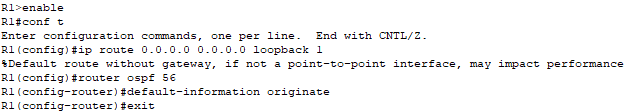
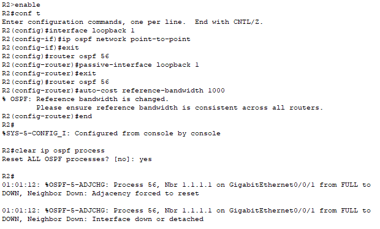
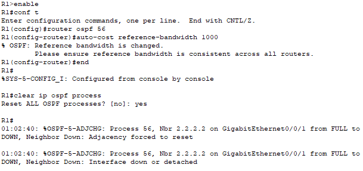
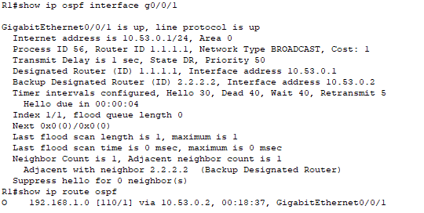
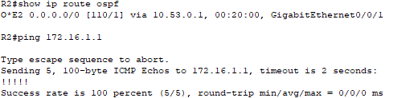

# Лабораторная работа - Настройка протокола OSPFv2 для одной области

## Топология

## Таблица адресации

## Часть 2. Настройка и проверка базовой работы протокола OSPFv2 для одной области

### Шаг 1. Настройте адреса интерфейса и базового OSPFv2 на каждом маршрутизаторе.

**Какой маршрутизатор является DR? Какой маршрутизатор является BDR? Каковы критерии отбора?**

R2 - DR, R1 - BDR
Приоритет по интерфейсов умолчанию 1, выбор проходит по RouterID - R2 имеет более высокий RouterID (2.2.2.2) поэтому он становится DR, а R1 - BDR

## Часть 3. Оптимизация и проверка конфигурации OSPFv2 для одной области

### Шаг 1. Реализация различных оптимизаций на каждом маршрутизаторе.

### Шаг 2. Убедитесь, что оптимизация OSPFv2 реализовалась.

**Почему стоимость OSPF для маршрута по умолчанию отличается от стоимости OSPF в R1 для сети 192.168.1.0/24?**

Стоимость отличается потому что сеть 192.168.1.0/24 является внутренним маршрутом OSPF, стоимость которого рассчитывается как сумма стоимостей интерфейсов по пути. Маршрут по умолчанию распространяется как внешний маршрут и по умолчанию получает метрику 1