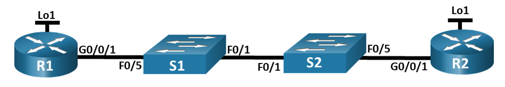
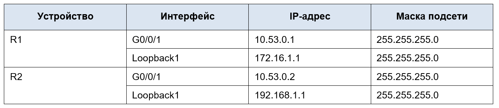
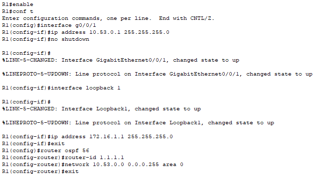
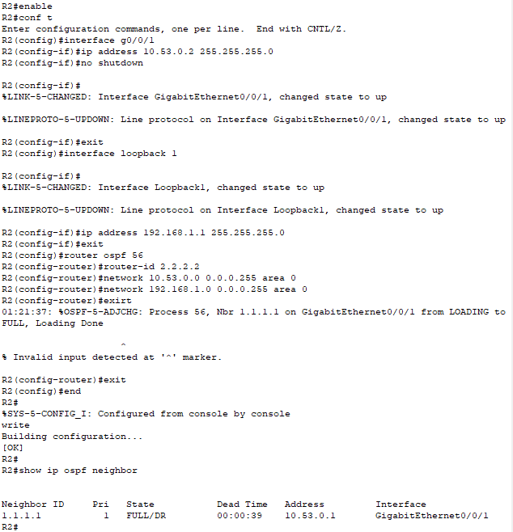
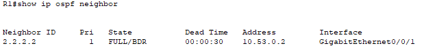
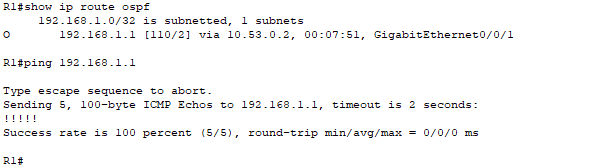

# Лабораторная работа - Настройка протокола OSPFv2 для одной области

## Топология

## Таблица адресации

## Часть 2. Настройка и проверка базовой работы протокола OSPFv2 для одной области

### Шаг 1. Настройте адреса интерфейса и базового OSPFv2 на каждом маршрутизаторе.

**Какой маршрутизатор является DR? Какой маршрутизатор является BDR? Каковы критерии отбора?**

R2 - DR, R1 - BDR
Приоритет по интерфейсов умолчанию 1, выбор проходит по RouterID - R2 имеет более высокий RouterID (2.2.2.2) поэтому он становится DR, а R1 - BDR

## Часть 3. Оптимизация и проверка конфигурации OSPFv2 для одной области

### Шаг 1. Реализация различных оптимизаций на каждом маршрутизаторе.

### Шаг 2. Убедитесь, что оптимизация OSPFv2 реализовалась.