# Лабораторная работа - Настройка и проверка расширенных списков контроля доступа

## Топология

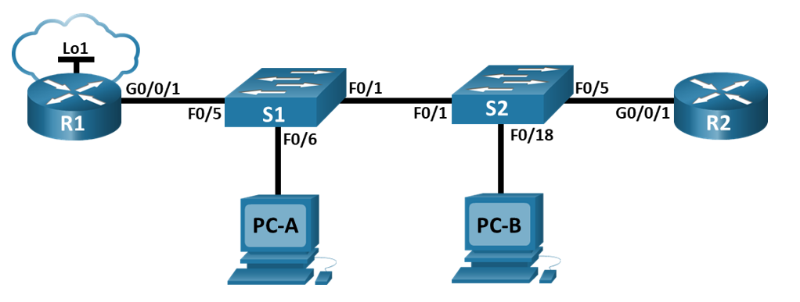

## Таблица адресации

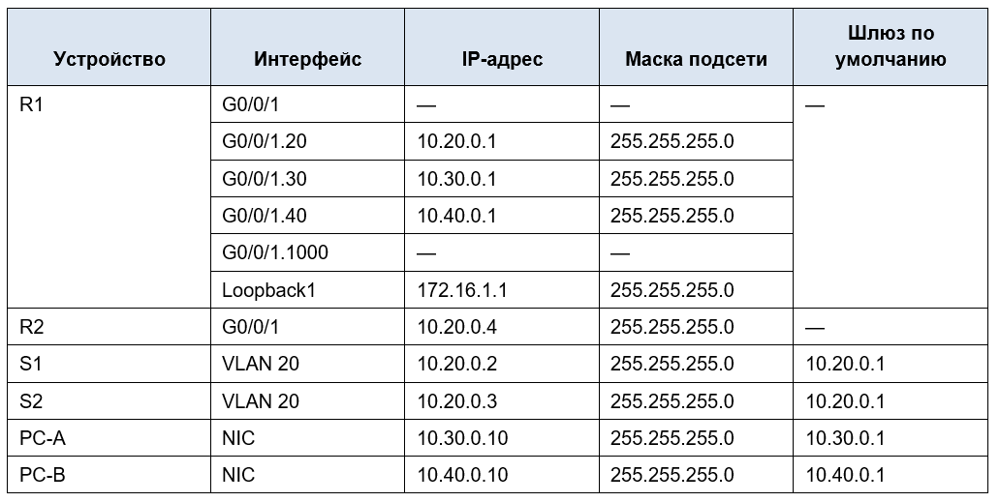

## Таблица VLAN

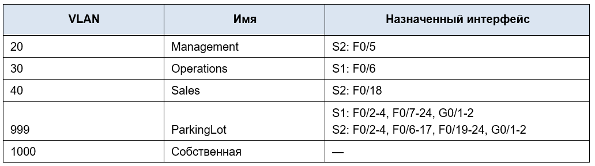

## Часть 2. Настройка сетей VLAN на коммутаторах.

### Шаг 1. Создайте сети VLAN на коммутаторах.

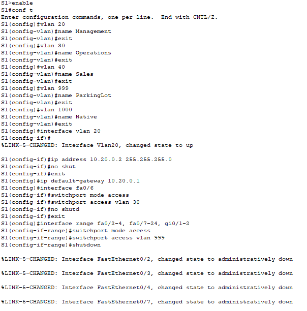

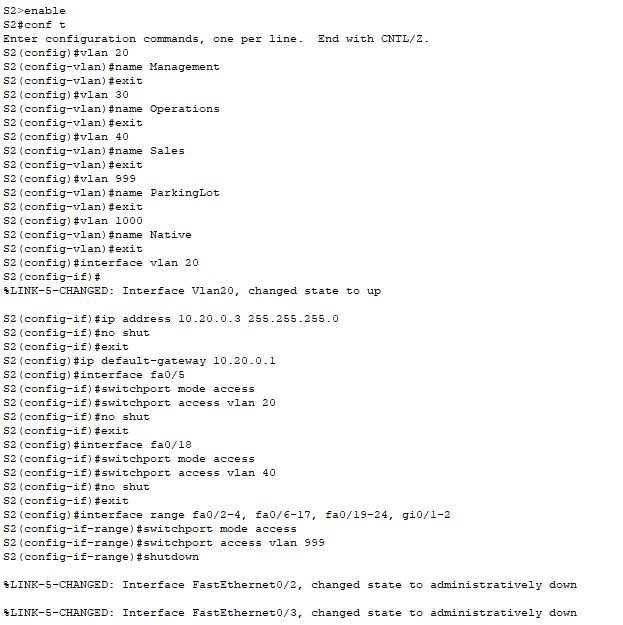

### Шаг 2. Назначьте сети VLAN соответствующим интерфейсам коммутатора.

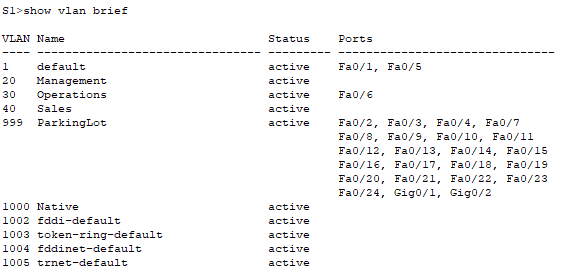

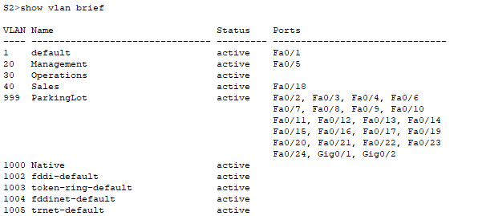

## Часть 3. Настройте транки (магистральные каналы).

### Шаг 1. Вручную настройте магистральный интерфейс F0/1.

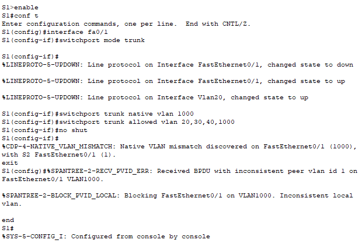

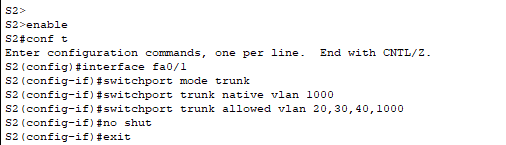

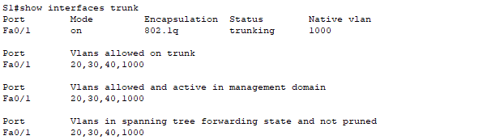

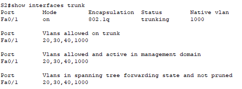

### Шаг 2. Вручную настройте магистральный интерфейс F0/5 на коммутаторе S1.

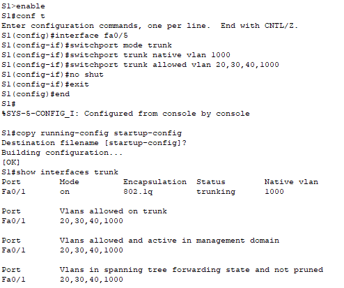

## Часть 4. Настройте маршрутизацию.

### Шаг 1. Настройка маршрутизации между сетями VLAN на R1.

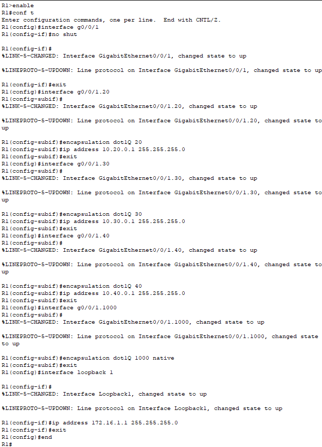

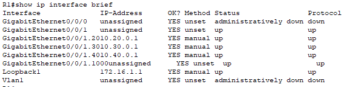

### Шаг 2. Настройка интерфейса R2 g0/0/1 с использованием адреса из таблицы и маршрута по умолчанию с адресом следующего перехода 10.20.0.1

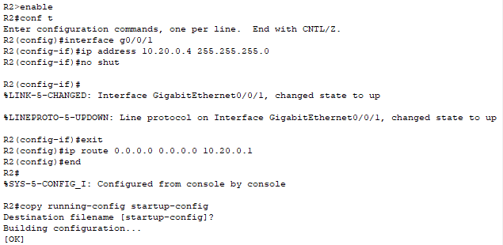

## Часть 5. Настройте удаленный доступ

### Шаг 1. Настройте все сетевые устройства для базовой поддержки SSH.

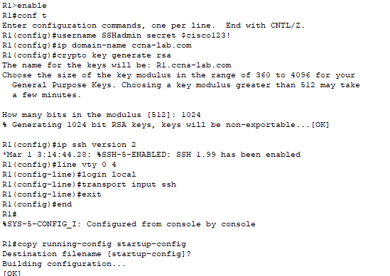

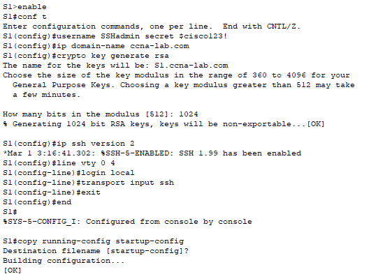

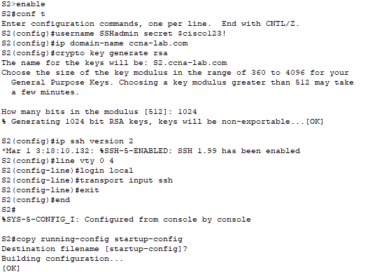

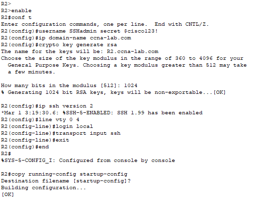

### Шаг 2. Включите защищенные веб-службы с проверкой подлинности на R1.

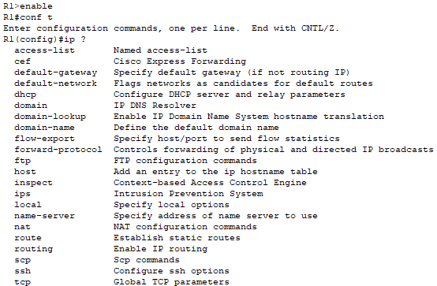

В CPT не поддерживается команда ip http

## Часть 6. Проверка подключения

### Шаг 1. Настройте узлы ПК.

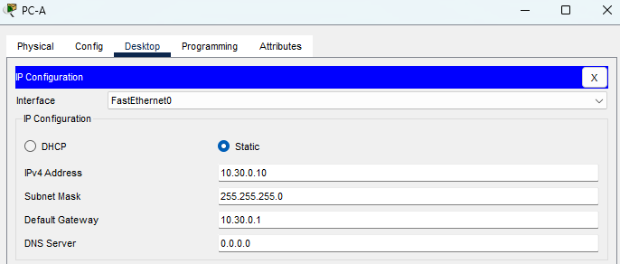

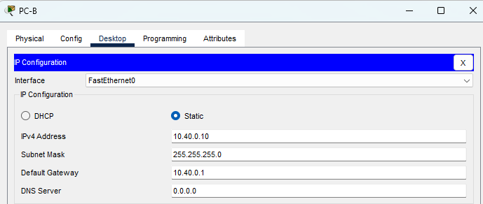

### Шаг 2. Выполните следующие тесты. Эхозапрос должен пройти успешно.

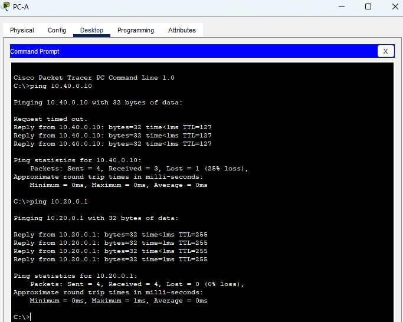

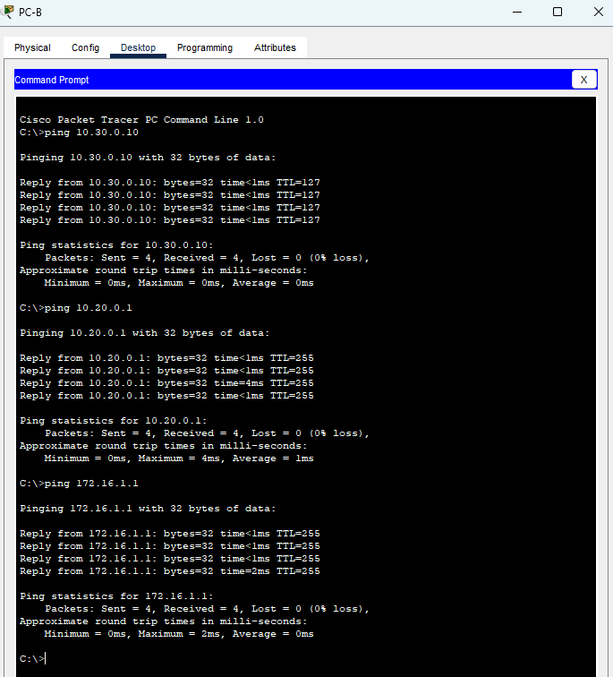

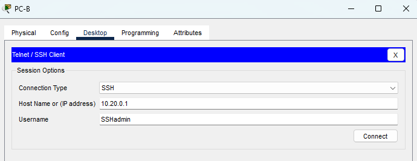

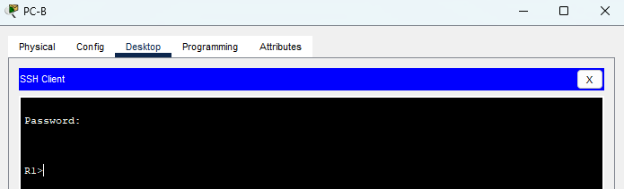

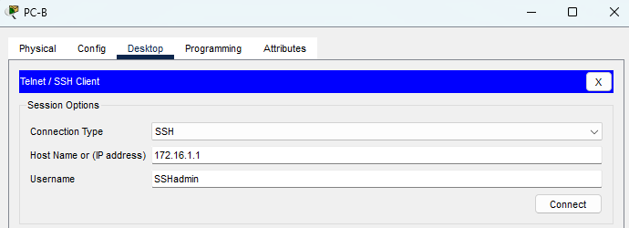

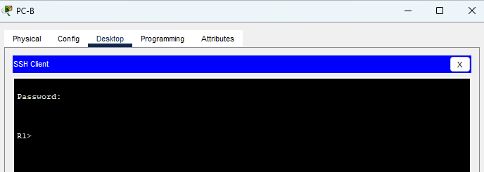

В CPT не поддерживается команда ip http, HTTP/S сервер недоступен

## Часть 7. Настройка и проверка списков контроля доступа (ACL)

### Политика 1 — запрет SSH в Management

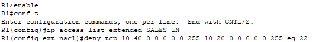

### Политика 2 — запрет HTTP/HTTPS в Management

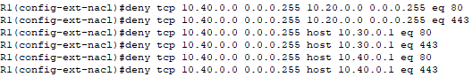

### Политика 3 — запрет ping в Operations и Management

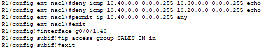

### Политика 4 — запрет ICMP в Sales

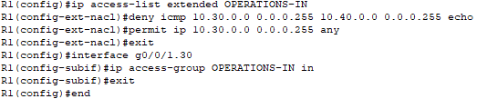

### Проверка ACL

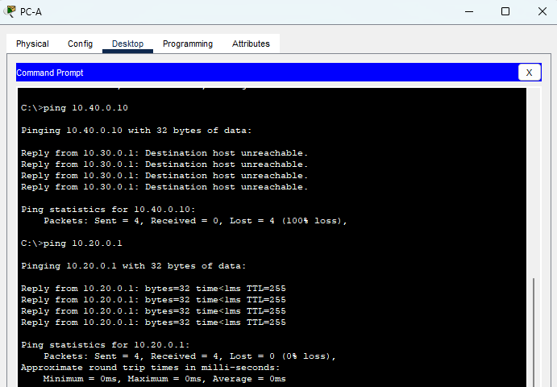

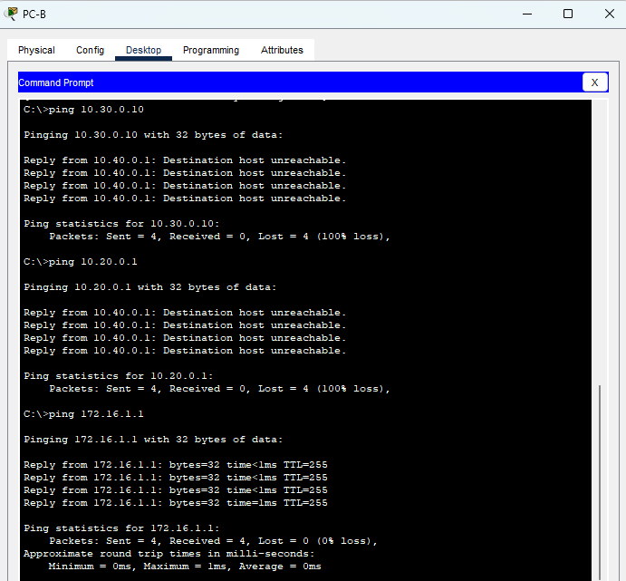

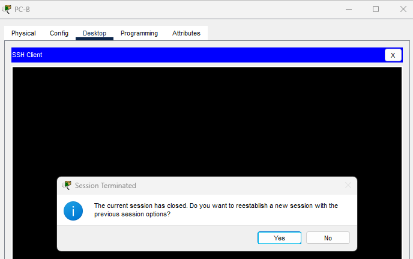

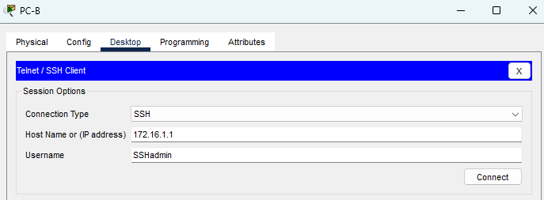

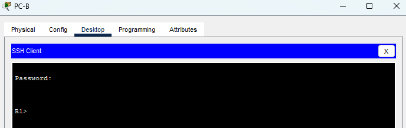