# Лабораторная работа - Настройка NAT для IPv4

## Топология

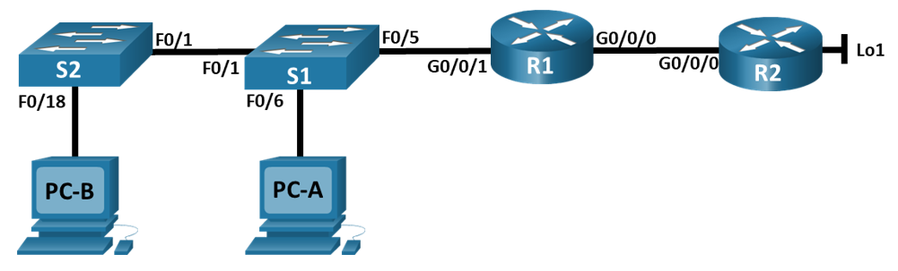

## Таблица адресации

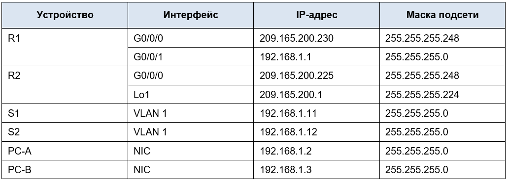

## Часть 1. Создание сети и настройка основных параметров устройства

### Шаг 2. Произведите базовую настройку маршрутизаторов.

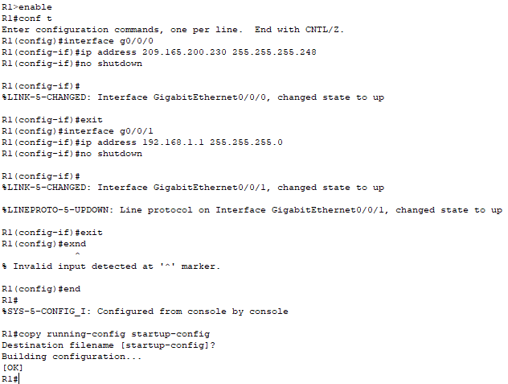

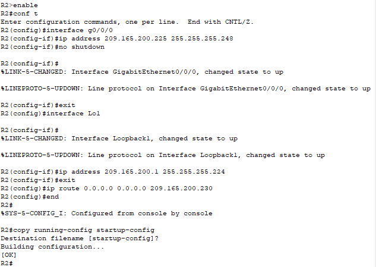

### Шаг 3. Настройте базовые параметры каждого коммутатора.

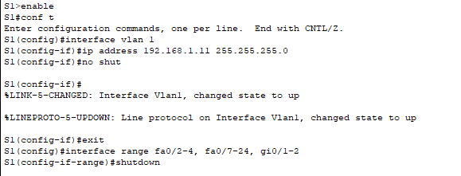

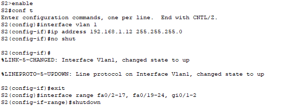

## Часть 2. Настройка и проверка NAT для IPv4.

### Шаг 1. Настройте NAT на R1, используя пул из трех адресов 209.165.200.226-209.165.200.228. 

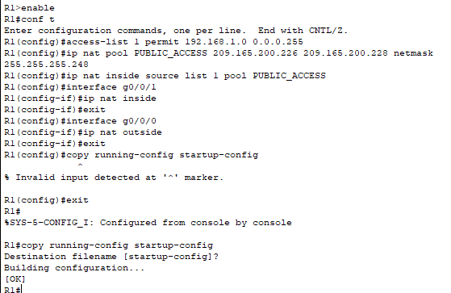

### Шаг 2. Проверьте и проверьте конфигурацию. 

Пререквизит к выполнению - добавить маршрут по умолчанию на R1 до R2, иначе ping с PC-B не пройдет - ip route 0.0.0.0 0.0.0.0 209.165.200.225

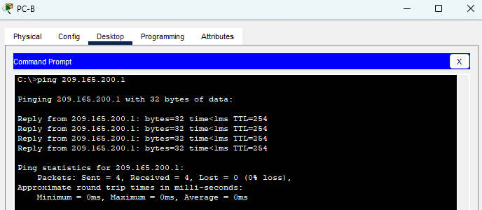

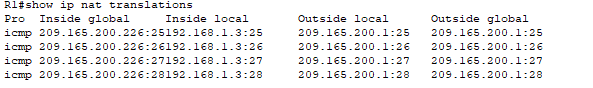

**Во что был транслирован внутренний локальный адрес PC-B?**

Внутренний локальный адрес PC-B 192.168.1.3 был преобразован в 209.165.200.226

**Какой тип адреса NAT является переведенным адресом?**

209.165.200.226 — Inside Global

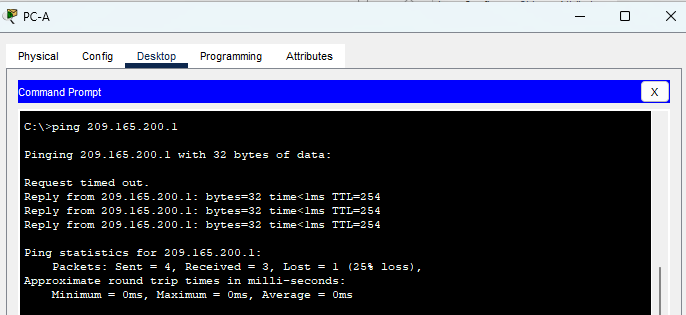

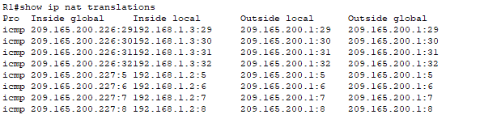

Пререквизит для S1 и S2 - указать маршрут по умолчанию ip default-gateway 192.168.1.1

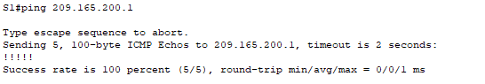

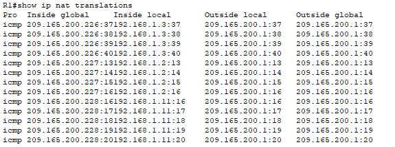

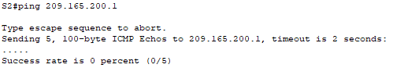

Команды show ip nat translations verbose нет в CPT

## Часть 3. Настройка и проверка PAT для IPv4.

### Шаг 1. Удалите команду преобразования на R1.

### Шаг 2. Добавьте команду PAT на R1.

### Шаг 3. Протестируйте и проверьте конфигурацию.

### Шаг 4. На R1 удалите команды преобразования nat pool.

### Шаг 5. Добавьте команду PAT overload, указав внешний интерфейс.

### Шаг 6. Протестируйте и проверьте конфигурацию. 

## Часть 4. Настройка и проверка статического NAT для IPv4.

### Шаг 1. На R1 очистите текущие трансляции и статистику.

### Шаг 2. На R1 настройте команду NAT, необходимую для статического сопоставления внутреннего адреса с внешним адресом.

### Шаг 3. Протестируйте и проверьте конфигурацию.

