# Лабораторная работа - Настройка протоколов CDP, LLDP и NTP

- [Лабораторная работа - Настройка протоколов CDP, LLDP и NTP](#лабораторная-работа---настройка-протоколов-cdp-lldp-и-ntp)
  - [Топология](#топология)
  - [Таблица адресации](#таблица-адресации)
  - [Часть 2. Обнаружение сетевых ресурсов с помощью протокола CDP](#часть-2-обнаружение-сетевых-ресурсов-с-помощью-протокола-cdp)
  - [Часть 3. Обнаружение сетевых ресурсов с помощью протокола LLDP](#часть-3-обнаружение-сетевых-ресурсов-с-помощью-протокола-lldp)
  - [Часть 4. Настройка NTP](#часть-4-настройка-ntp)
    - [Шаг 1. Выведите на экран текущее время.](#шаг-1-выведите-на-экран-текущее-время)
    - [Шаг 2. Установите время.](#шаг-2-установите-время)
    - [Шаг 3. Настройте главный сервер NTP.](#шаг-3-настройте-главный-сервер-ntp)
    - [Шаг 4. Настройте клиент NTP.](#шаг-4-настройте-клиент-ntp)
    - [Шаг 5. Проверьте настройку NTP.](#шаг-5-проверьте-настройку-ntp)
  - [Вопрос для повторения](#вопрос-для-повторения)

## Топология

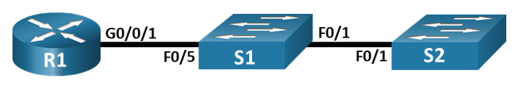

## Таблица адресации

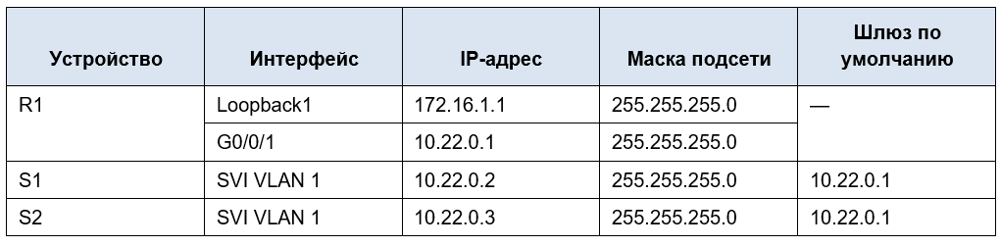

## Часть 2. Обнаружение сетевых ресурсов с помощью протокола CDP

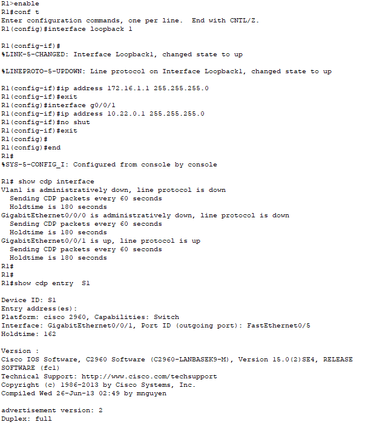

**Сколько интерфейсов участвует в объявлениях CDP? Какие из них активны?**

В объявлениях CDP участвуют 3 интерфейса: VLAN1, GigabitEthernet0/0/0 и GigabitEthernet0/0/1.
Активен только GigabitEthernet0/0/1.

**Какая версия IOS используется на  S1?**

Cisco IOS Software, C2960 Software (C2960-LANBASEK9-M), Version 15.0(2)SE4, RELEASE SOFTWARE (fc1)

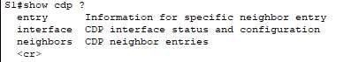

Команды show cdp traffic в CPT на коммутаторах нет

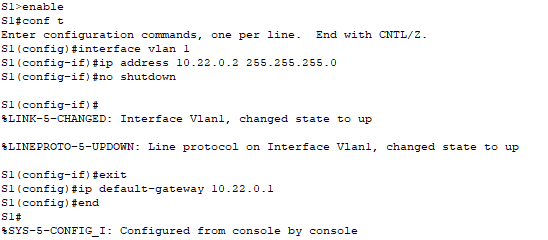

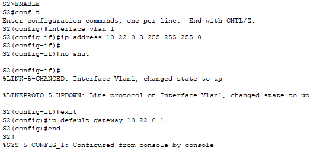

**Какие дополнительные сведения доступны теперь?**

После настройки коммутаторов дополнительные сведения - IP адрес на S1

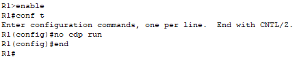

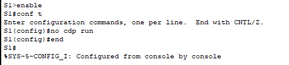

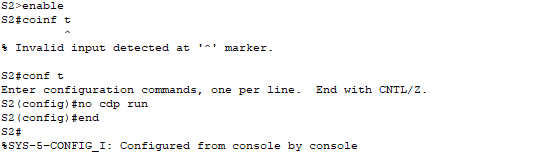

## Часть 3. Обнаружение сетевых ресурсов с помощью протокола LLDP

Что бы включить LLDP на всех устройствах в топологии, необходимо ввести команду lldp run в режиме глобальной конфигурации.

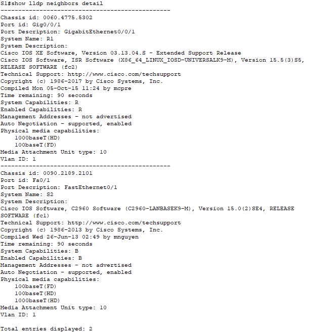

В CPT нет команды show lldp entry на коммутаторах, алтернатива - команда show lldp neighbors detail.

**Что такое chassis ID  для коммутатора S2?**

Это идентификатор  устройства в LLDP, в роли Chassis ID часто используется MAC адрес устройства.

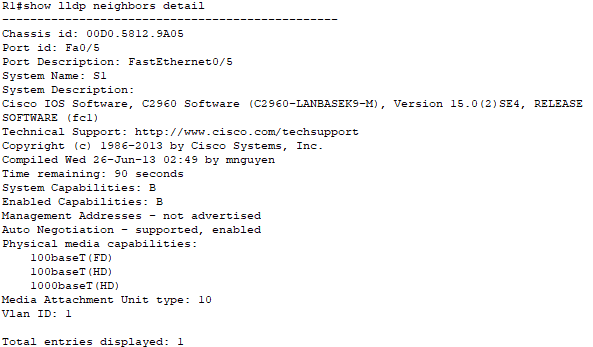

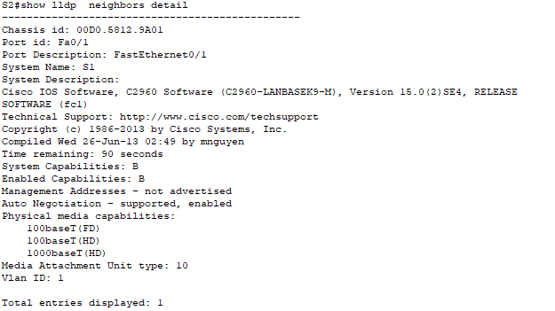

## Часть 4. Настройка NTP

### Шаг 1. Выведите на экран текущее время.

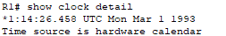

### Шаг 2. Установите время.

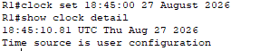

### Шаг 3. Настройте главный сервер NTP.

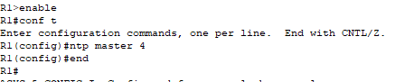

### Шаг 4. Настройте клиент NTP.

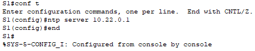

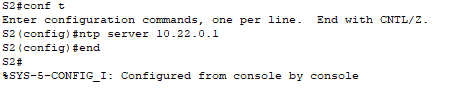

### Шаг 5. Проверьте настройку NTP.

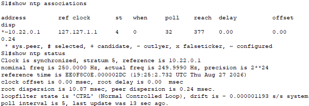

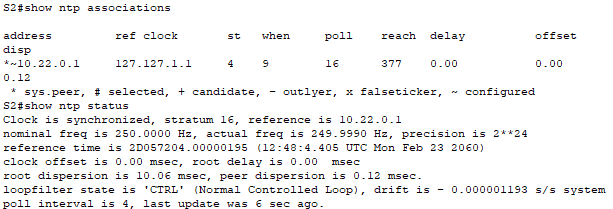

После настройки NTP время на S1 и S2 синхронизировалось со временем на R1. Оба коммутатора используют R1 (10.22.0.1) в качестве источника NTP.

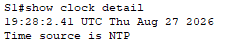

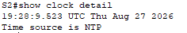

## Вопрос для повторения

**Для каких интерфейсов в пределах сети не следует использовать протоколы обнаружения сетевых ресурсов? Поясните ответ.**

CDP и LLDP не следует использовать на интерфейсах, подключённых к внешним или недоверенным сетям. Эти протоколы раскрывают информацию об устройстве и сети, которая может быть использована злоумышленниками.