# Лабораторная работа - Настройка и проверка расширенных списков контроля доступа

## Топология

## Таблица адресации

## Таблица VLAN

## Часть 1. Настройка сетей VLAN на коммутаторах.

### Шаг 1. Создание сетей VLAN на коммутаторах.

### Шаг 2. Настройка портов на коммутаторах.

### Шаг 3. Проверка.

## Часть 2. Настройка Trunk и резервирования

### Шаг 1. Настройка Trunk соединений.

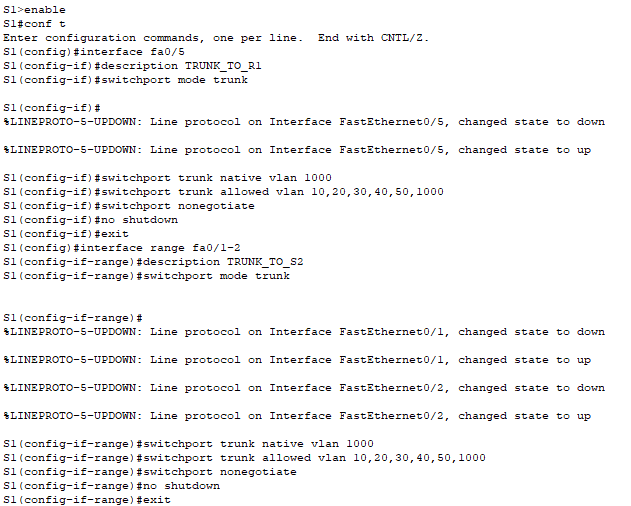

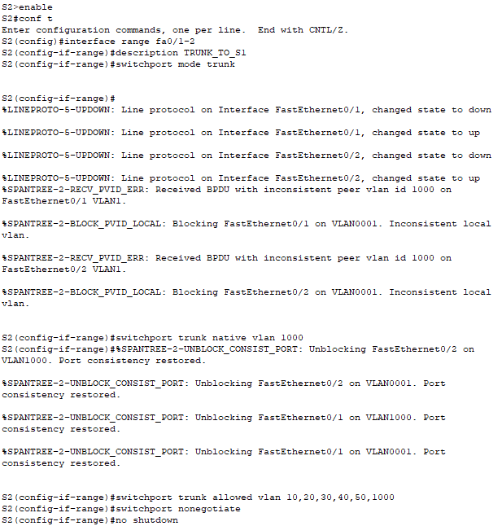

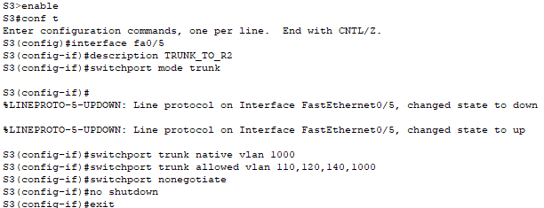

### Шаг 2. Настройка режима STP.

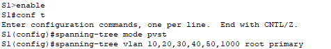

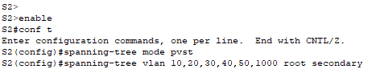

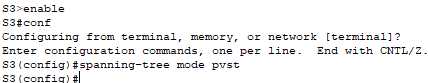

### Шаг 3. Проверка Root Bridge и резервирования

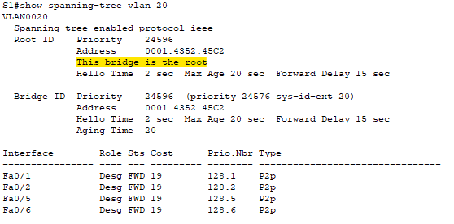

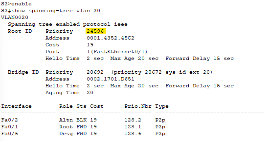

### Шаг 4. Проверка переключения на резервный канал

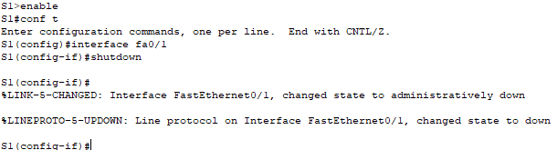

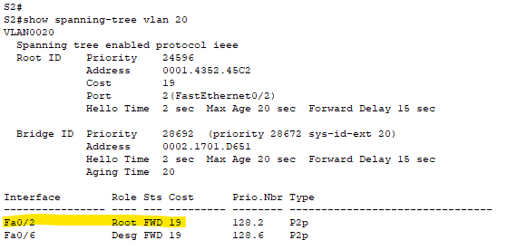

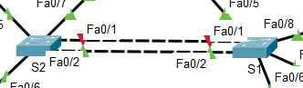

### Шаг 5. Настройка PortFast на портах ПК

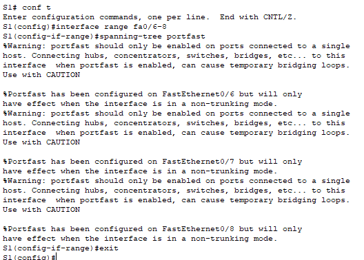

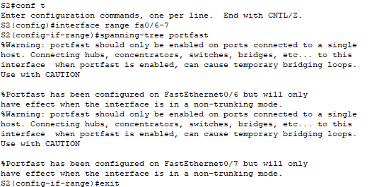

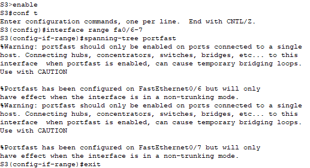

### Шаг 6. Включение BPDU Guard на портах ПК

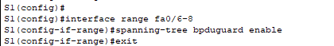

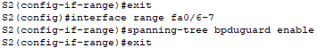

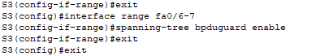

### Шаг 7. Проверка итоговых конфигураций

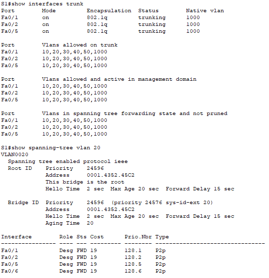

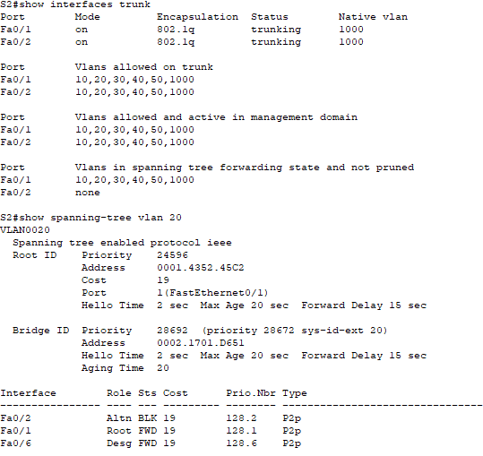

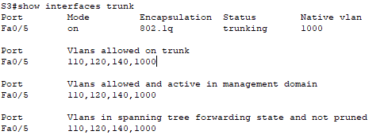

