# Лабораторная работа - Настройка и проверка расширенных списков контроля доступа

## Топология

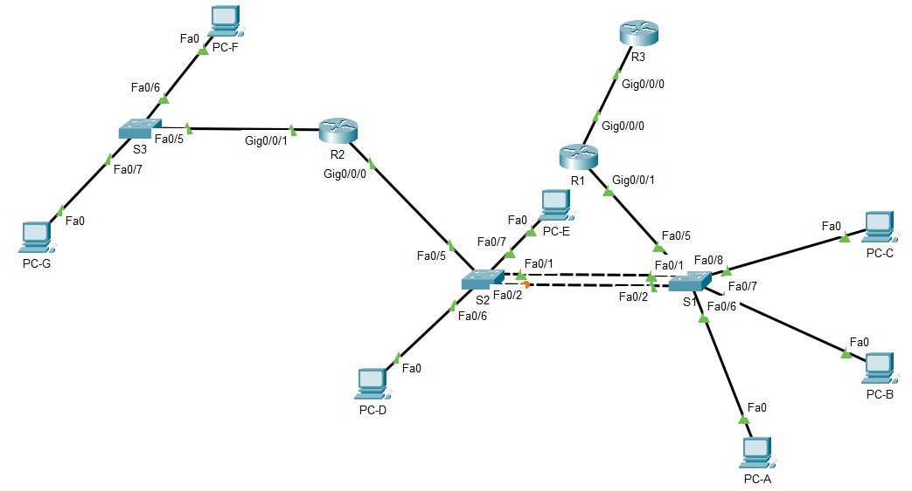

## Таблица адресации

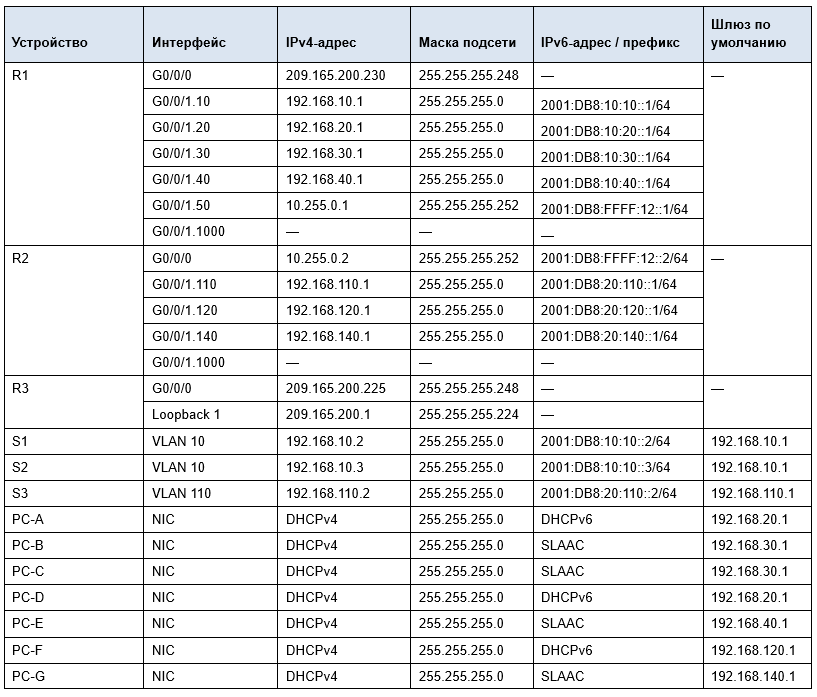

## Таблица VLAN

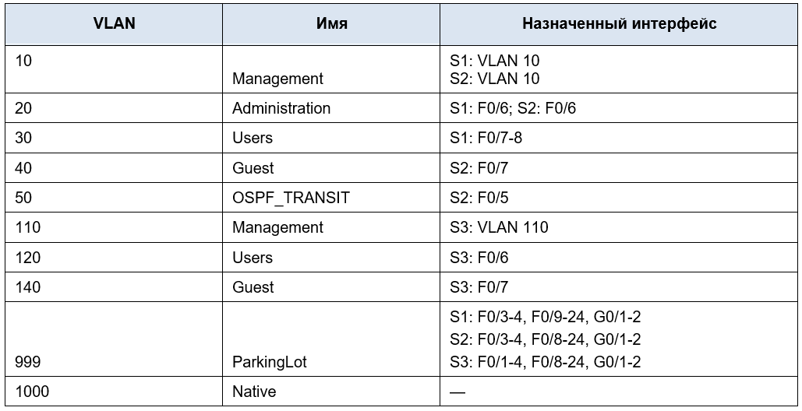

## Часть 1. Настройка сетей VLAN на коммутаторах.

### Шаг 1. Создание сетей VLAN на коммутаторах.

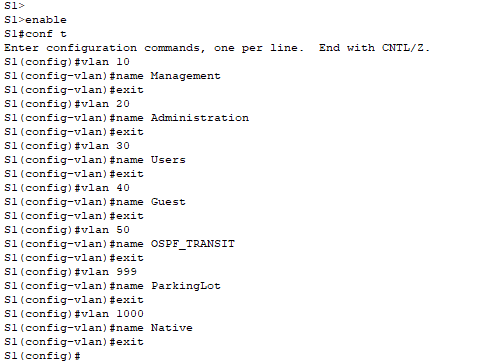

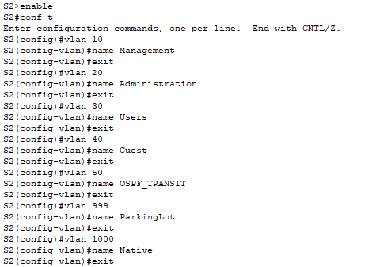

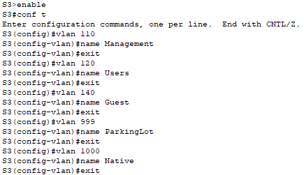

### Шаг 2. Настройка портов на коммутаторах.

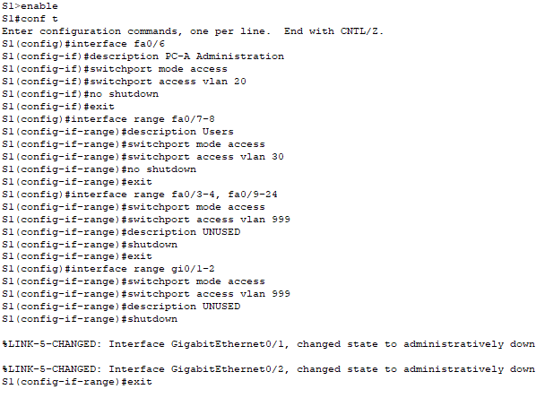

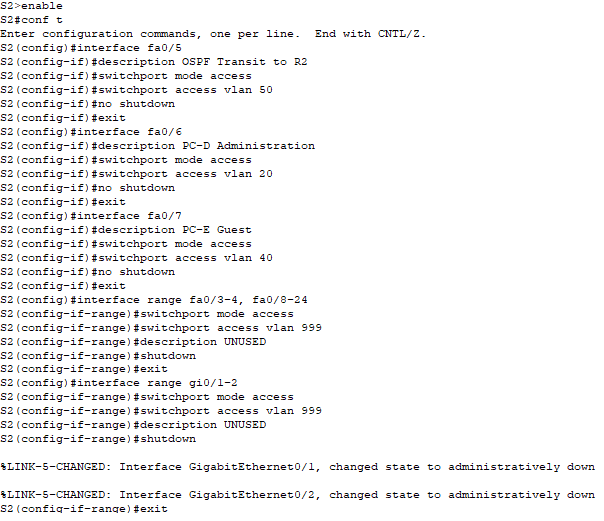

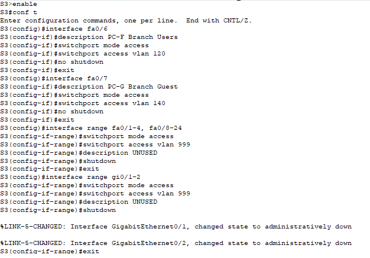

### Шаг 3. Проверка.

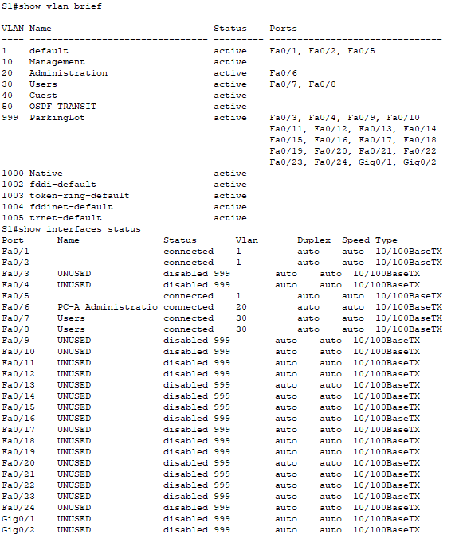

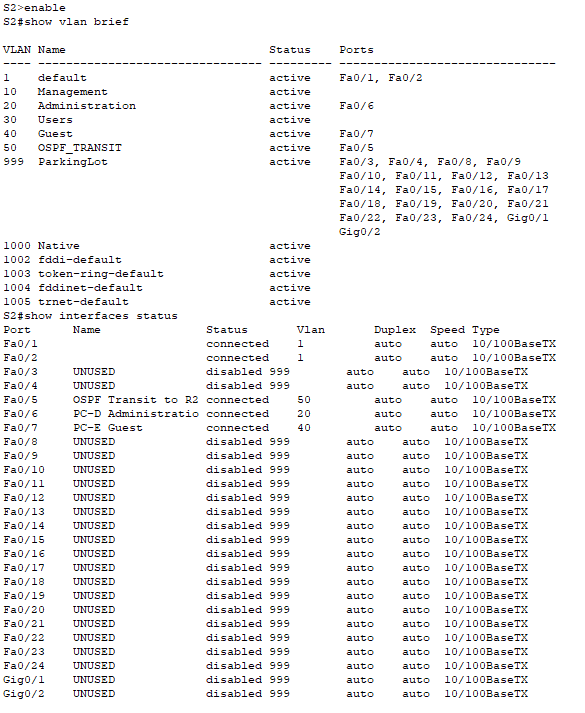

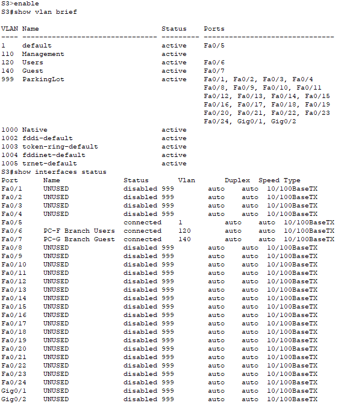

## Часть 2. Настройка Trunk и резервирования

