# Проектная работа - Построение сети с нуля

- [Проектная работа - Построение сети с нуля](#проектная-работа---построение-сети-с-нуля)
  - [Топология](#топология)
  - [Таблица адресации](#таблица-адресации)
  - [Таблица VLAN](#таблица-vlan)
  - [Часть 1. Настройка сетей VLAN на коммутаторах.](#часть-1-настройка-сетей-vlan-на-коммутаторах)
    - [Шаг 1. Создание сетей VLAN на коммутаторах.](#шаг-1-создание-сетей-vlan-на-коммутаторах)
    - [Шаг 2. Настройка портов на коммутаторах.](#шаг-2-настройка-портов-на-коммутаторах)
    - [Шаг 3. Проверка.](#шаг-3-проверка)
  - [Часть 2. Настройка Trunk и резервирования](#часть-2-настройка-trunk-и-резервирования)
    - [Шаг 1. Настройка Trunk соединений.](#шаг-1-настройка-trunk-соединений)
    - [Шаг 2. Настройка режима STP.](#шаг-2-настройка-режима-stp)
    - [Шаг 3. Проверка Root Bridge и резервирования](#шаг-3-проверка-root-bridge-и-резервирования)
    - [Шаг 4. Проверка переключения на резервный канал](#шаг-4-проверка-переключения-на-резервный-канал)
    - [Шаг 5. Настройка PortFast на портах ПК](#шаг-5-настройка-portfast-на-портах-пк)
    - [Шаг 6. Включение BPDU Guard на портах ПК](#шаг-6-включение-bpdu-guard-на-портах-пк)
    - [Шаг 7. Проверка итоговых конфигураций](#шаг-7-проверка-итоговых-конфигураций)
  - [Часть 3. Настройка IPv4 и Router-on-a-Stick](#часть-3-настройка-ipv4-и-router-on-a-stick)
    - [Шаг 1. Настройка интерфейсов на R1](#шаг-1-настройка-интерфейсов-на-r1)
    - [Шаг 2. Настройка интерфейсов на R2](#шаг-2-настройка-интерфейсов-на-r2)
    - [Шаг 3. Настройка интерфейсов на R3](#шаг-3-настройка-интерфейсов-на-r3)
    - [Шаг 4. Настрйока Management VLAN на коммутаторах](#шаг-4-настрйока-management-vlan-на-коммутаторах)
    - [Шаг 5. Проверки сетевой связанности маршрутизаторов и коммутаторов](#шаг-5-проверки-сетевой-связанности-маршрутизаторов-и-коммутаторов)
  - [Часть 4. Настройка DHCPv4](#часть-4-настройка-dhcpv4)
    - [Шаг 1. Исключение служебных адресов и создание пулов на R1](#шаг-1-исключение-служебных-адресов-и-создание-пулов-на-r1)
    - [Шаг 2. Исключение служебных адресов и создание пулов на R2](#шаг-2-исключение-служебных-адресов-и-создание-пулов-на-r2)
    - [Шаг 3. Настройка ПК](#шаг-3-настройка-пк)
    - [Шаг 4. Проверка адресов ПК](#шаг-4-проверка-адресов-пк)
    - [Шаг 5. Проверка DHCP на R1 и R2](#шаг-5-проверка-dhcp-на-r1-и-r2)
    - [Шаг 6. Ping шлюзов с ПК](#шаг-6-ping-шлюзов-с-пк)
    - [Шаг 7. Ping между ПК](#шаг-7-ping-между-пк)
  - [Часть 5. Настройка IPv6, SLAAC и DHCPv6](#часть-5-настройка-ipv6-slaac-и-dhcpv6)
    - [Шаг 1. IPv6-маршрутизация на R1 и R2](#шаг-1-ipv6-маршрутизация-на-r1-и-r2)
    - [Шаг 2. Настройка адресов IPv6, VLAN и DHCPv6 на R1](#шаг-2-настройка-адресов-ipv6-vlan-и-dhcpv6-на-r1)
    - [Шаг 3. Настройка адресов IPv6, VLAN и DHCPv6 на R2](#шаг-3-настройка-адресов-ipv6-vlan-и-dhcpv6-на-r2)
    - [Шаг 4. Ping R1 \<-\> R2 по IPv6](#шаг-4-ping-r1---r2-по-ipv6)
    - [Шаг 5. Настройка SLAAC на ПК](#шаг-5-настройка-slaac-на-пк)
    - [Шаг 6. Настройка DHCPv6 на ПК](#шаг-6-настройка-dhcpv6-на-пк)
    - [Шаг 7. Проверка DHCPv6 на маршрутизаторах](#шаг-7-проверка-dhcpv6-на-маршрутизаторах)
    - [Шаг 8. Проверка связи ПК со шлюзом](#шаг-8-проверка-связи-пк-со-шлюзом)
    - [Шаг 9. Проверка связи между ПК из разных VLAN](#шаг-9-проверка-связи-между-пк-из-разных-vlan)
    - [Шаг 10.  Проверка таблиц IPv6-маршрутизации](#шаг-10--проверка-таблиц-ipv6-маршрутизации)
  - [Часть 6. Статическая и динамическая маршрутизация](#часть-6-статическая-и-динамическая-маршрутизация)
    - [Шаг 1. Статический маршрут по умолчанию на R1](#шаг-1-статический-маршрут-по-умолчанию-на-r1)
    - [Шаг 2. Настройка OSPF на R1](#шаг-2-настройка-ospf-на-r1)
    - [Шаг 3. Отключение OSPF Hello-пакеты в пользовательских VLAN](#шаг-3-отключение-ospf-hello-пакеты-в-пользовательских-vlan)
    - [Шаг 4. Маршрут по умолчанию через OSPF](#шаг-4-маршрут-по-умолчанию-через-ospf)
    - [Шаг 5. Настройте OSPF на R2](#шаг-5-настройте-ospf-на-r2)
    - [Шаг 6. Проверка OSPF-маршрутов на маршрутизаторах](#шаг-6-проверка-ospf-маршрутов-на-маршрутизаторах)
    - [Шаг 7. Проверка маршрутизации на ПК](#шаг-7-проверка-маршрутизации-на-пк)
    - [Шаг 8. Настройка IPv6-маршрутизации на R1/R2](#шаг-8-настройка-ipv6-маршрутизации-на-r1r2)
    - [Шаг 9. Проверка IPv6-маршрутизации на ПК](#шаг-9-проверка-ipv6-маршрутизации-на-пк)
    - [Шаг 10. Итоговая проверка OSPF](#шаг-10-итоговая-проверка-ospf)
  - [Часть 7. ACL](#часть-7-acl)
    - [Шаг 1. Определение политик безопасности](#шаг-1-определение-политик-безопасности)
    - [Шаг 2. ACL для HQ Guest](#шаг-2-acl-для-hq-guest)
    - [Шаг 3. ACL для HQ Users](#шаг-3-acl-для-hq-users)
    - [Шаг 4. ACL для Branch Guest](#шаг-4-acl-для-branch-guest)
    - [Шаг 5. ACL для Branch Users](#шаг-5-acl-для-branch-users)
    - [Шаг 6. Проверка HQ Guest](#шаг-6-проверка-hq-guest)
    - [Шаг 7. Проверка Branch Guest](#шаг-7-проверка-branch-guest)
    - [Шаг 8. Проверка Users](#шаг-8-проверка-users)
  - [Часть 8. Настройка NAT/PAT](#часть-8-настройка-natpat)
    - [Шаг 1. Внешний NAT-интерфейс](#шаг-1-внешний-nat-интерфейс)
    - [Шаг 2. Внутренние NAT-интерфейсы](#шаг-2-внутренние-nat-интерфейсы)
    - [Шаг 3. ACL для адресов NAT](#шаг-3-acl-для-адресов-nat)
    - [Шаг 4. PAT через R1](#шаг-4-pat-через-r1)
    - [Шаг 5. Проверка PAT](#шаг-5-проверка-pat)
    - [Шаг 6. Static NAT для PC-A](#шаг-6-static-nat-для-pc-a)
  - [Часть 9. Настройка и проверка CDP и LLDP](#часть-9-настройка-и-проверка-cdp-и-lldp)
    - [Шаг 1. Проверка работы CDP на роутерах и маршрутизаторах](#шаг-1-проверка-работы-cdp-на-роутерах-и-маршрутизаторах)
    - [Шаг 2. Отключение CDP на всех устройствах для проверки LLDP](#шаг-2-отключение-cdp-на-всех-устройствах-для-проверки-lldp)
    - [Шаг 3. Проверка LLDP](#шаг-3-проверка-lldp)
  - [Часть 10. Настройка NTP](#часть-10-настройка-ntp)
    - [Шаг 1. Проверка и настройка R1 как NTP Master](#шаг-1-проверка-и-настройка-r1-как-ntp-master)
    - [Шаг 2. Настройка клиентов](#шаг-2-настройка-клиентов)
    - [Шаг 3. Проверка работы NTP](#шаг-3-проверка-работы-ntp)
  - [Часть 11. Защищённое удалённое управление (SSH)](#часть-11-защищённое-удалённое-управление-ssh)
    - [Шаг 1. Настройка SSH на R1/2 и S1/2/3](#шаг-1-настройка-ssh-на-r12-и-s123)
    - [Шаг 2. Ограничение SSH административной сетью](#шаг-2-ограничение-ssh-административной-сетью)
    - [Шаг 3. Проверка SSH и ограничений](#шаг-3-проверка-ssh-и-ограничений)

## Топология

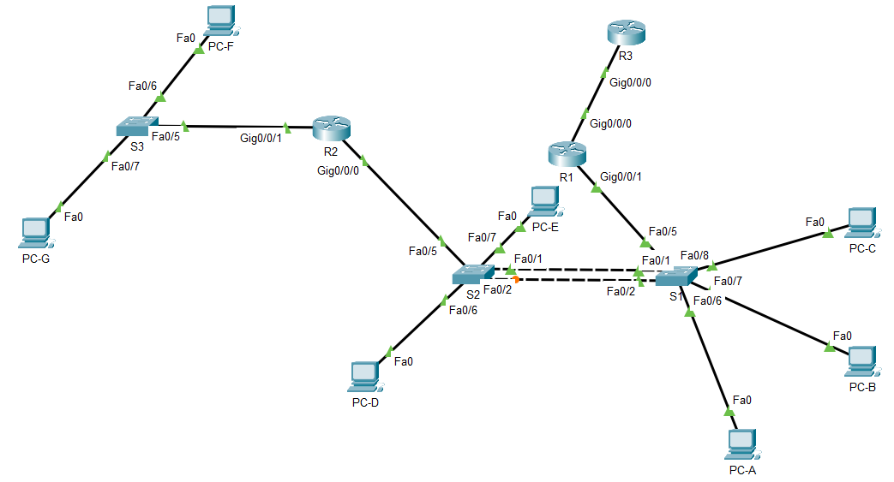

## Таблица адресации

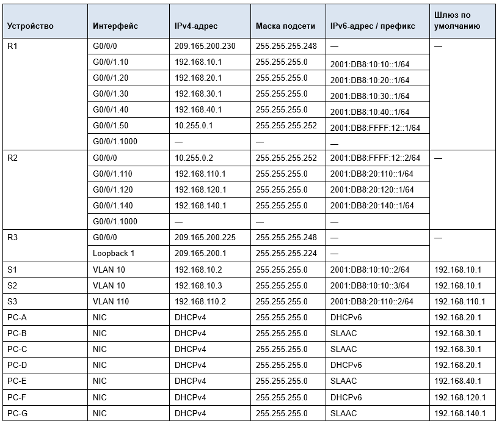

## Таблица VLAN

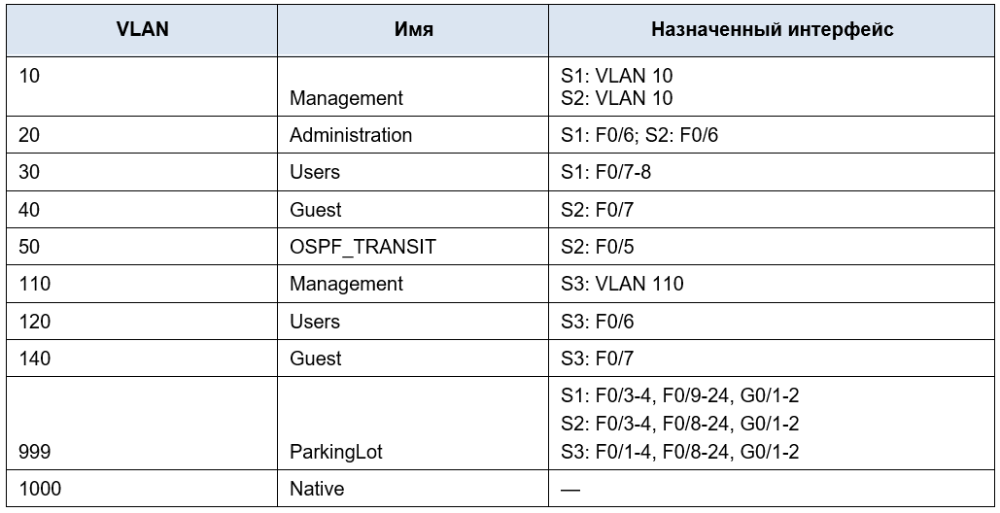

## Часть 1. Настройка сетей VLAN на коммутаторах.

### Шаг 1. Создание сетей VLAN на коммутаторах.

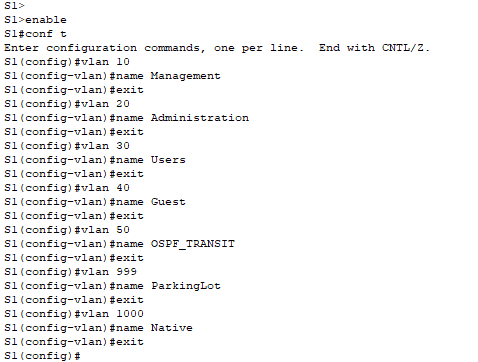

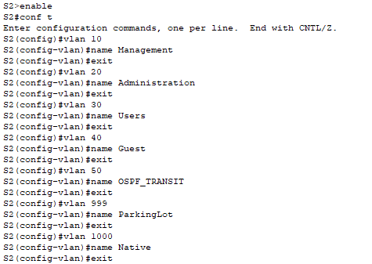

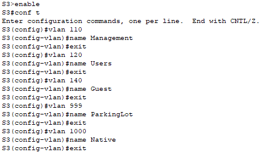

### Шаг 2. Настройка портов на коммутаторах.

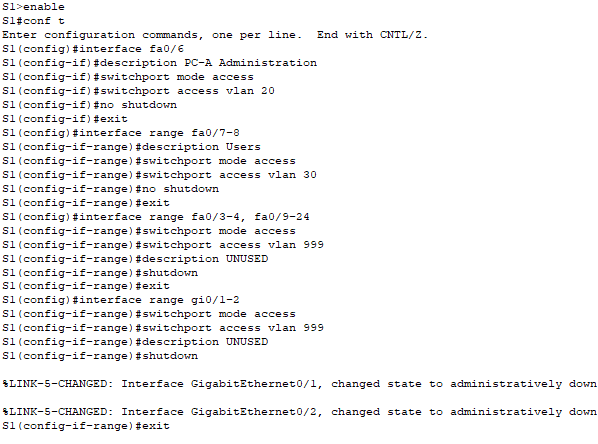

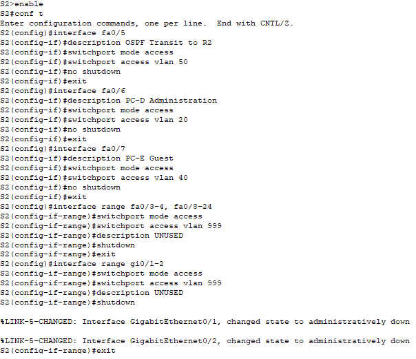

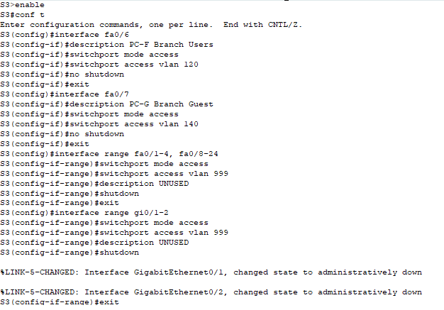

### Шаг 3. Проверка.

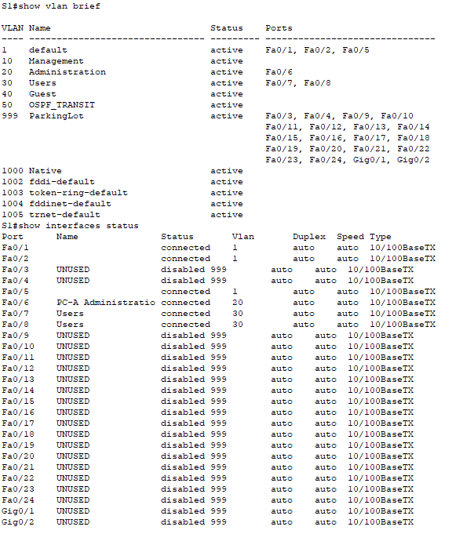

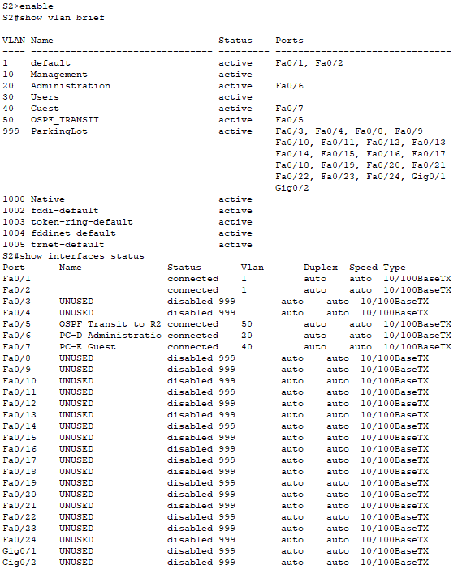

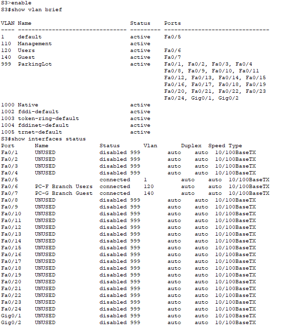

## Часть 2. Настройка Trunk и резервирования

### Шаг 1. Настройка Trunk соединений.

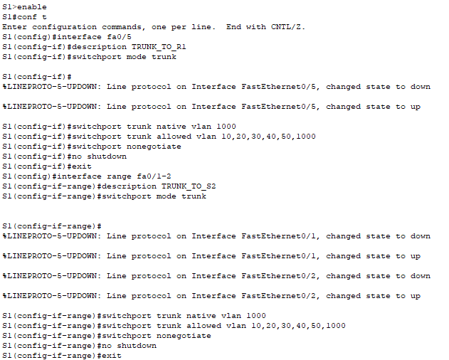

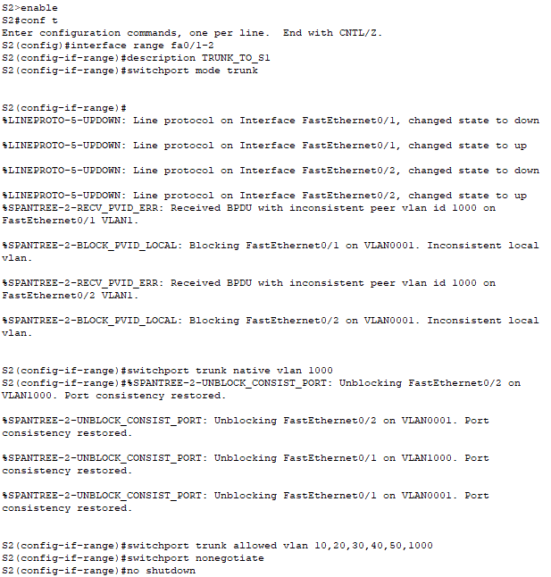

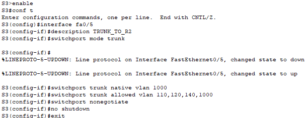

### Шаг 2. Настройка режима STP.

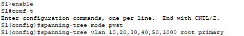

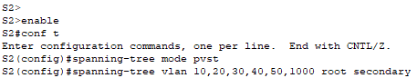

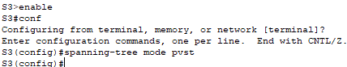

### Шаг 3. Проверка Root Bridge и резервирования

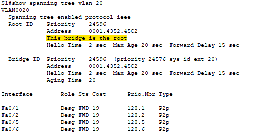

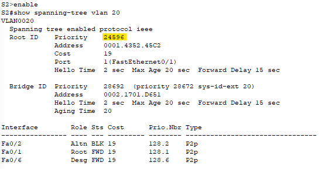

### Шаг 4. Проверка переключения на резервный канал

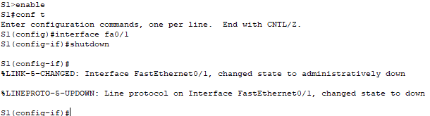

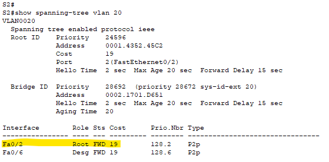

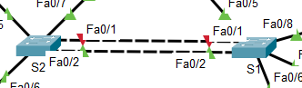

### Шаг 5. Настройка PortFast на портах ПК

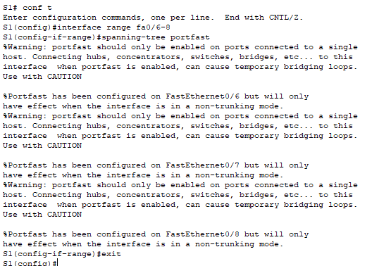

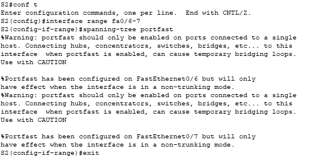

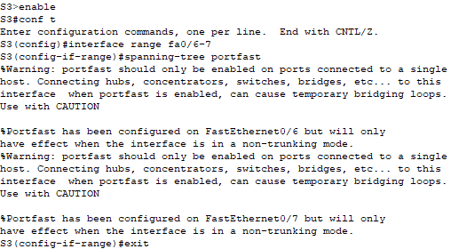

### Шаг 6. Включение BPDU Guard на портах ПК

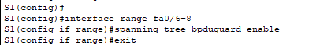

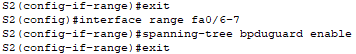

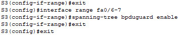

### Шаг 7. Проверка итоговых конфигураций

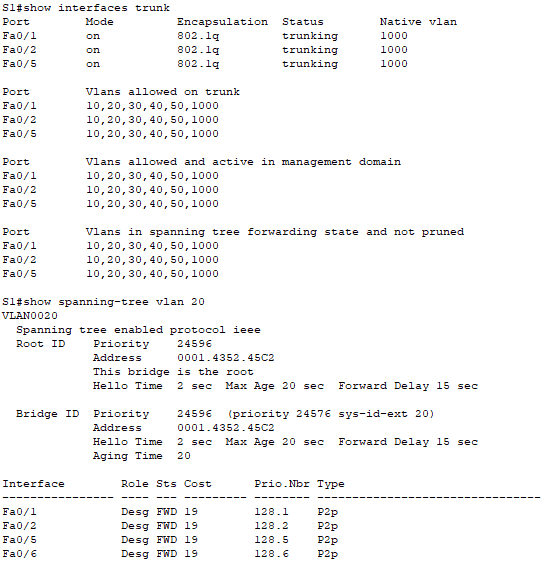

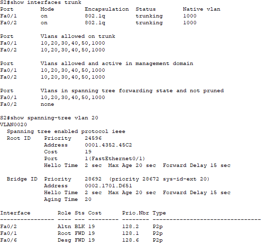

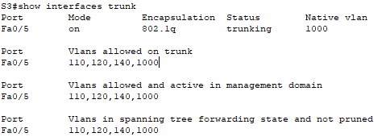

## Часть 3. Настройка IPv4 и Router-on-a-Stick

### Шаг 1. Настройка интерфейсов на R1

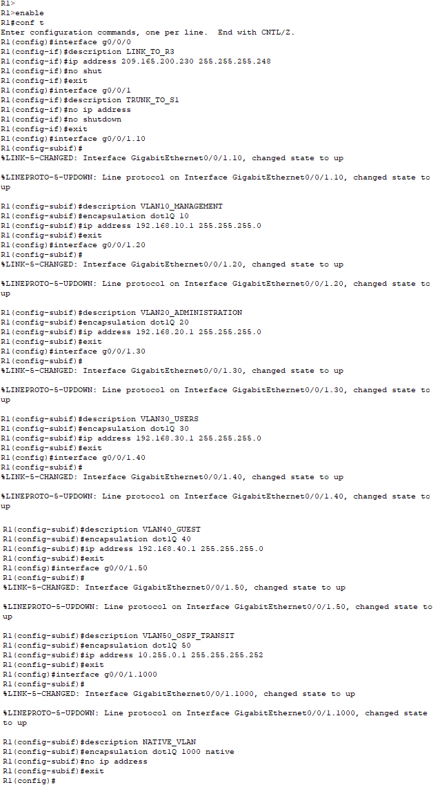

### Шаг 2. Настройка интерфейсов на R2

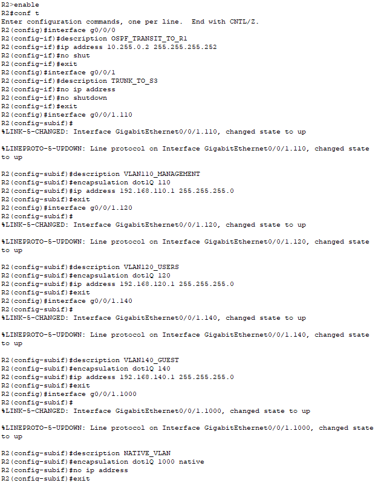

### Шаг 3. Настройка интерфейсов на R3

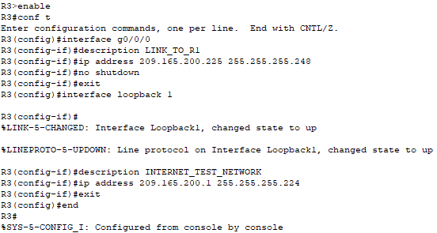

### Шаг 4. Настрйока Management VLAN на коммутаторах

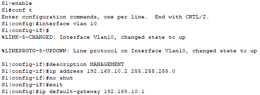

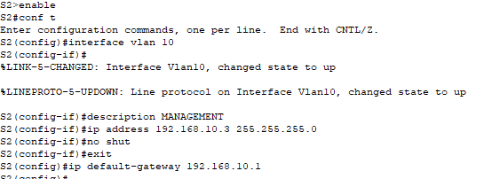

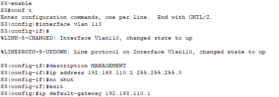

### Шаг 5. Проверки сетевой связанности маршрутизаторов и коммутаторов

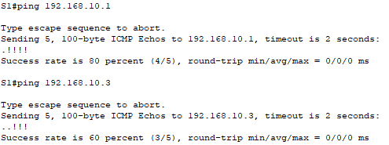

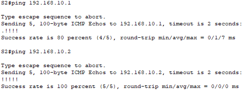

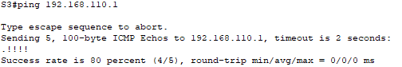

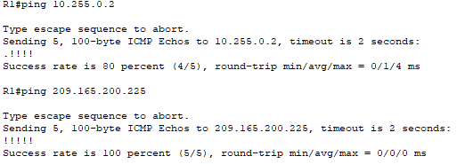

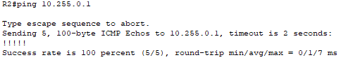

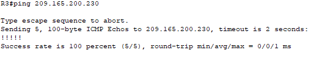

## Часть 4. Настройка DHCPv4

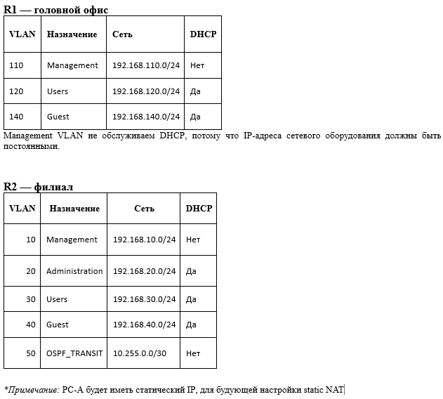

### Шаг 1. Исключение служебных адресов и создание пулов на R1

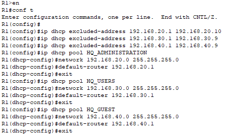

### Шаг 2. Исключение служебных адресов и создание пулов на R2

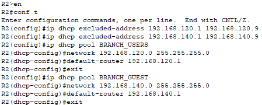

### Шаг 3. Настройка ПК

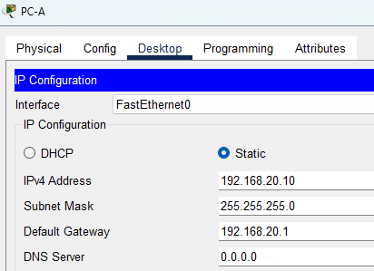

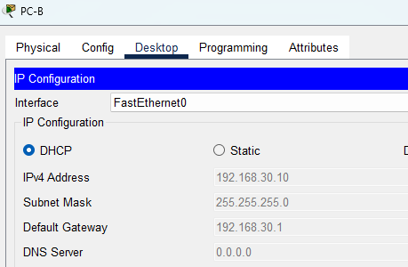

DHCP включен на PC-B — PC-G

### Шаг 4. Проверка адресов ПК

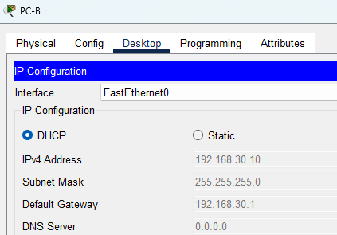


### Шаг 5. Проверка DHCP на R1 и R2


### Шаг 6. Ping шлюзов с ПК


### Шаг 7. Ping между ПК

PC-B → PC-E

VLAN30 → VLAN40


PC-F → PC-G

VLAN120 → VLAN140


## Часть 5. Настройка IPv6, SLAAC и DHCPv6


### Шаг 1. IPv6-маршрутизация на R1 и R2


### Шаг 2. Настройка адресов IPv6, VLAN и DHCPv6 на R1


### Шаг 3. Настройка адресов IPv6, VLAN и DHCPv6 на R2


### Шаг 4. Ping R1 <-> R2 по IPv6


### Шаг 5. Настройка SLAAC на ПК

PC-B


PC-C


PC-E


PC-G


### Шаг 6. Настройка DHCPv6 на ПК

PC-A


PC-D 


PC-F 


### Шаг 7. Проверка DHCPv6 на маршрутизаторах


### Шаг 8. Проверка связи ПК со шлюзом


### Шаг 9. Проверка связи между ПК из разных VLAN

PC-B → PC-A

VLAN30 → VLAN20


PC-F → PC-G

VLAN120 → VLAN140


### Шаг 10.  Проверка таблиц IPv6-маршрутизации


## Часть 6. Статическая и динамическая маршрутизация

Логика маршрутизации

               209.165.200.1
                  R3 Lo1
                    |
                    |
                   R3
              209.165.200.225
                    |
            Static Default Route
                    |
              209.165.200.230
                   R1
                    |
              10.255.0.1
                    |
                OSPF Area 0
                    |
              10.255.0.2
                   R2

### Шаг 1. Статический маршрут по умолчанию на R1


### Шаг 2. Настройка OSPF на R1

OSPF process ID = 56

Area = 0

Router ID R1 = 1.1.1.1

Router ID R2 = 2.2.2.2


###  Шаг 3. Отключение OSPF Hello-пакеты в пользовательских VLAN

###  Шаг 4. Маршрут по умолчанию через OSPF


### Шаг 5. Настройте OSPF на R2


### Шаг 6. Проверка OSPF-маршрутов на маршрутизаторах


### Шаг 7. Проверка маршрутизации на ПК

HQ → Branch

PC-B → PC-F


Branch → HQ

PC-F → PC-A


### Шаг 8. Настройка IPv6-маршрутизации на R1/R2


### Шаг 9. Проверка IPv6-маршрутизации на ПК

HQ → Branch

PC-B → PC-F


Branch → HQ

PC-F → IPv6-шлюз VLAN 30 HQ


### Шаг 10. Итоговая проверка OSPF


## Часть 7. ACL

### Шаг 1. Определение политик безопасности

| № | Источник | Назначение | Политика |
|---:|---|---|---|
| 1 | HQ Guest VLAN 40 | Все корпоративные IPv4-сети | **Deny** |
| 2 | Branch Guest VLAN 140 | Все корпоративные IPv4-сети | **Deny** |
| 3 | HQ Guest / Branch Guest | Internet | **Permit** |
| 4 | HQ Users VLAN 30 | Management VLAN 10 и 110 по SSH | **Deny TCP/22** |
| 5 | Branch Users VLAN 120 | Management VLAN 10 и 110 по SSH | **Deny TCP/22** |
| 6 | Administration VLAN 20 | Management | **Permit** |
| 7 | Остальной пользовательский трафик | Разрешённые сети | **Permit** |

### Шаг 2. ACL для HQ Guest


### Шаг 3. ACL для HQ Users


### Шаг 4. ACL для Branch Guest


### Шаг 5. ACL для Branch Users


### Шаг 6. Проверка HQ Guest

PC-E → шлюз 


PC-E → S1


PC-E → PC-A


PC-E → PC-B


PC-E → PC-F


### Шаг 7. Проверка Branch Guest

PC-G → шлюз 


PC-G → S3


PC-E → PC-F


PC-E → HQ 


### Шаг 8. Проверка Users

PC-B → Management


PC-F → Branch


## Часть 8. Настройка NAT/PAT

Логическая схема

                    INTERNET
                        |
                       R3
                        |
         209.165.200.224/29
                        |
                       R1
                NAT / PAT EDGE
                   /         \
                  /           \
      209.165.200.229       209.165.200.230
          Static NAT             PAT
              |                   |
            PC-A              остальные

### Шаг 1. Внешний NAT-интерфейс


### Шаг 2. Внутренние NAT-интерфейсы 


### Шаг 3. ACL для адресов NAT

### Шаг 4. PAT через R1

### Шаг 5. Проверка PAT


### Шаг 6. Static NAT для PC-A


## Часть 9. Настройка и проверка CDP и LLDP

### Шаг 1. Проверка работы CDP на роутерах и маршрутизаторах


### Шаг 2. Отключение CDP на всех устройствах для проверки LLDP

Отключение командой no cdp run


Аналогично на других устройствах

### Шаг 3. Проверка LLDP 

Командой lldp run запускаем LLDP на всех устройствах

Проверяем


## Часть 10. Настройка NTP 

Схема NTP

                           R1
                     NTP MASTER
                      Stratum 4
                    /     |      \
                   /      |       \
                 S1       S2       R2
                                    \
                                     \
                                      S3

### Шаг 1. Проверка и настройка R1 как NTP Master


### Шаг 2. Настройка клиентов


### Шаг 3. Проверка работы NTP


## Часть 11. Защищённое удалённое управление (SSH)

Username:    SSHadmin \
Password:    cisco123 \
Domain:      lab.com \
SSH version: 2 \
RSA:         1024 bit

### Шаг 1. Настройка SSH на R1/2 и S1/2/3


### Шаг 2. Ограничение SSH административной сетью  


### Шаг 3. Проверка SSH и ограничений

PC-A (VLAN 20 - Административный)


PC-B (VLAN 30)


PC-F (VLAN 120)


PC-E (VLAN 40)

